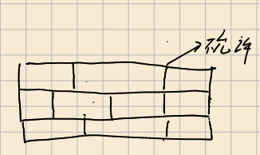

# 积木墙
<center>  


</center>


这是一道动态规划，但是很难去想。因为有一个特殊的条件，所以需要两段动态规划。
<center> 

 

不允许强有一道直通地下的裂缝
</center>

方法就是使用排除法

首先计算所有的砖块摆放情况，然后再计算不满足题意的情况，方法就是按照从左到右第一次出现墙裂缝的方法枚举不满足的情况。具体实现看代码。

```cpp
#include <cstdio>
#include <iostream>
#include <math.h>
using namespace std;
int main() {
  long long dp[100] = {1};
  long long dpn_line[100] = {1};
  long long dp_real[100] = {0};
  int t;
  scanf("%d", &t);
  while (t--) {
    int n, m;
    scanf("%d%d", &n, &m);
    dp[0] = 1;
    dpn_line[0] = 1;
    for (int i = 1; i <= m; i++) {
      dp[i] = 0;
      for (int j = 1; j <= 4; j++) {
        if (i - j < 0)
          continue;
        dp[i] += dp[i - j];
      }
      dpn_line[i] = (long long)pow(dp[i], n);
    }
    dp_real[1] = 1;
    dp_real[0] = 1;
    long long reverse = 0;
    for (int i = 2; i <= m; i++) {
      reverse = 0;
      for (int j = 1; i - j >= 1; j++) {
        reverse += dp_real[j] * dpn_line[i - j];
      }
      dp_real[i] = dpn_line[i] - reverse;
    }
    printf("%lld\n",dp_real[m]);
  }

  return 0;
}
```


