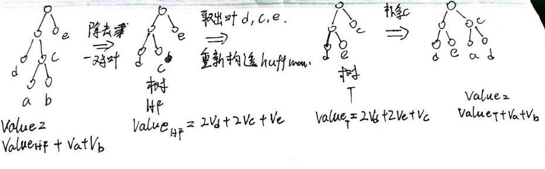
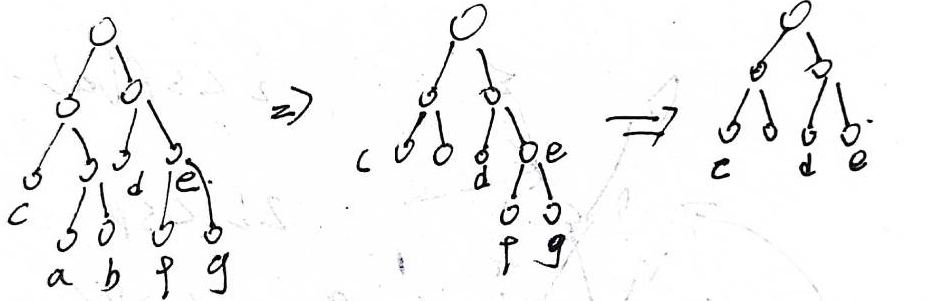
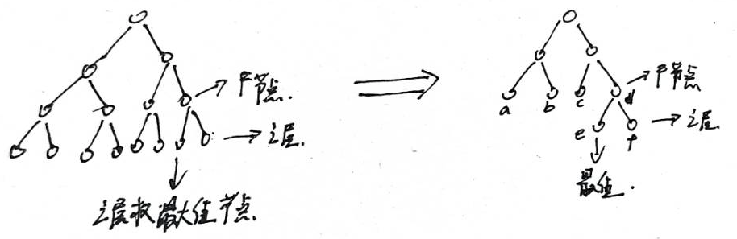
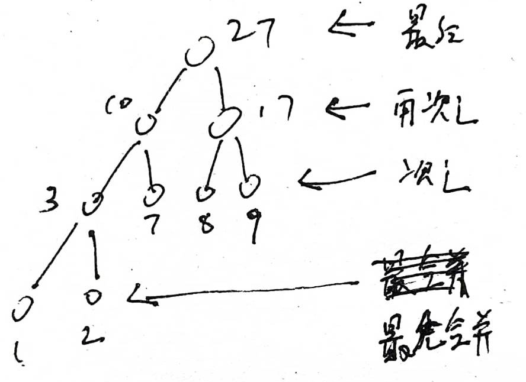

<font size=5>

[toc]

## uva1072 huffman编码
### 题意：
&emsp;&emsp;给定huffman树的结构，且huffma树必须满足某节点的左子树根节点权值小于右子树根节点权值，问，当叶节点权值和为100时，有多少种赋值情况使得叶节点的权值能够保证当前树结构为huffman树
<center>


不同权重的安排方式

</center>

## 解：
&emsp;&emsp;想要解决这个题目，首先要知道huffman编码的一个性质，这里直接给出，后面再证明这个性质。
<center>


图二：按照线的顺序看权值。
</center>

### 性质

可以看到图二的遍历顺序为层序遍历，此层序遍历先访问右节点，记这个遍历顺序为<font color=red><b>顺序A</b></font>，每个节点的权值是递减的。目前我们不做证明，直接给出性质<br>
&emsp;&emsp;条件A：树节点权值满足huffman树，且节点的左子树根节点权值小于右子树根节点权值<br>
&emsp;&emsp;条件B：树结构满足huffman树（除根节点度为2，非叶节点度为3，叶子节点度为1，可以通过huffman树的构建过程证明），树的层序遍历且先遍历右边节点的顺序遍历节点，所遍历的权值为递减序，且父节点权值为两个子节点权值的和。

性质就是：  
条件A与条件B是等价的，即二者为充要条件。<br>

### 代码

知道这个条件之后，也就是说，我们去使用dfs按照顺序A来枚举每个节点的权值，权值满足条件B即可，因为满足条件B就是满足条件A。<br>
下面是本题的代码
```cpp
#include <cstring>
#include <iostream>
using namespace std;

const int maxx = 2 * 1024  *1024 + 20;  // 实际上空间是可以优化的，但是，我没有去优化。。。。。。。值要考虑建树的细节，就不需要这么多的节点
int tree[maxx];
int bfs_tree_node[maxx];
int val_tree[maxx];
int ans = 0;

void dfs(int finish_num, int all_posi) {
  if (finish_num == all_posi) {
    ans++;
    return;
  }
  int now_posi = bfs_tree_node[finish_num];
  int sp_val = val_tree[now_posi / 2];
  int last_val = val_tree[bfs_tree_node[finish_num - 1]];
  int lr = now_posi % 2; // 1表示右边，0表示左边
  if (lr == 1) { // 右边元素确定，左边元素也就确定了，这里先定右边的元素，
    for (int i = 1, j = sp_val - i; i <= j; i++, j--) {
      if(j > last_val)continue;
      // 1 <= i <= j <= last_val
      val_tree[now_posi] = j;
      val_tree[now_posi - 1] = i;
      dfs(finish_num + 1,all_posi);
    }
  } 
  else {
    dfs(finish_num + 1, all_posi);
  }
  return;
}

int main() {
  int n;
  int Case = 1;
  while (scanf("%d", &n) == 1 && n != 0) {
    ans = 0;
    memset(tree, 0, sizeof(tree));
    for (int i = 0; i < n; i++) {
      char temp[maxx];
      scanf("%s", temp);
      int root = 1;
      for (int j = 0; temp[j]; j++) {
        tree[root] = 1; //
        if (temp[j] == '1') {
          root = 2 * root + 1;
        } else {
          root = 2 * root;
        }
      }
      tree[root] = 2;
    }
    bfs_tree_node[0] = 1;
    int now_length = 1;
    int now_place = 0;
    while (now_place < now_length) {
      if (tree[bfs_tree_node[now_place]] == 1) {
        bfs_tree_node[now_length++] = 2 * bfs_tree_node[now_place] + 1;
        bfs_tree_node[now_length++] = 2 * bfs_tree_node[now_place];
      }
      now_place++;
    }
    val_tree[1] = 100;
    dfs(1, now_length);
    printf("Case %d: %d\n",Case++,ans
  }

  return 0;
}
```

<font size = 7>以下部分是本题中的关键，在往下看的时候先思考10分钟。<br>
## 证明条件A和条件B是等价的</font>
这个部分需要另外几个推导进行支撑<br>
1. 一个huffman树去掉一对相邻的叶子节点之后，此时刚刚的叶子节点的父节点作为叶节点，且权值为刚刚两节点的和，这样所得的节点权值及其树形结构依旧是一个huffman树。<br>
在这里,<b><font color=red>一对叶节点指的是父节点相同的节点</font></b>
<center>


比如说，d不和任何一个节点属于一对叶节点，ab属于一对叶节点
</center>
2. huffman树中第i层中的最小元素比第i+1层的最大元素要大。（这里层数是指：子结点所在层数比父节点要大，根节点所在层数最小）<br>


这两个部分是本题的证明难点所在。<br>


### 证明1：<font size = 5>一个huffman树去掉一对相邻叶子节点之后所得的节点权值及其树形结构依旧是一个huffman树</font><br>

方法1 ： 这个证明和huffman树构建有关，就是构建huffman的优先队列中，在合并的时候，优先队列并不会管这个时不是叶子节点，也就是说，一个节点加入队列，可以看作叶子节点，也可不看作叶子节点，如果我们在构件的时候把一对叶子节点删除，并将其合成节点加入队列，重新构建huffman树，并不会影响其构建过程（此处证明省略了一些，主要看方法2）


方法2 ： 这个涉及到huffman树的性质，对于一个树（任意一个树），所有叶子节点到根节点的距离（即编码长度）乘以叶节点的权值之和记为`value`，对于将已知节点作为叶子节点的所有树形结构中，huffman树是使`value`达到最小的树形结构。
<font size=4>
$$
\begin{align}
& huffman_{value} = min_{j\in all\_style\_tree}(\sum_{i\in tree_j[leaf\_node]}weight_i * code\_length_i) \\ 
& 其中：\\
& weigth_i表示节点i的权值\\
& code\_length_i表示节点i的编码长度\\
& all\_style\_tree表示所有形式的树\\
& huffman_{value}表示huffman树的value值。\\
& tree[leaf\_node]表式一个树中的所有叶节点的集合\\
& all\_style\_tree表示所有形式的tree结构
\end{align}
$$
<center>  
</font>


删除一对叶节点
</center>

将一对叶节点去掉，此时的树形结构记为树HF，剩余的叶节点取出与新的叶节点（刚刚去掉的两个叶节点的父节点）重新构建huffman树，记为树T。如果树T的value小于树HF，那么我们可以使用树T的结构去替换HF的结构，再将原先去掉的两个节点加入到原先的父节点，这个时候所得的树计算的value应该比原先的huffman树的value小，这与huffman树的性质相违背，所以，将一对叶节点去掉所得到的树依旧是huffman树。（注意，删除叶节点后再计算value，所得结果仅损失$v_a + v_b$，其中$v_a$表示的是a节点的权值大小，所以能够清楚的计算出变型后树的权值变化）
<center>



上述的变化过程
</center>

ps ： 实际上方法一和方法二很可能是等价的，因为huffman树的性质和huffman树的构建过程，二者是等价的，所以无论用谁，<b><font color=green>都能给整个证明引入huffman树的信息</font></b>。


### 证明2：<font size = 5>huffman树中第i层中的最小元素比第i+1层的最大元素要大。（子结点所在层任意节点权值比父节点所在层任意节点权值要小）</font><br>

已知huffman树的任意一对叶子节点去掉之后我们可以得到一个huffman树，那么我们将i层以下的节点全部去掉，得到的依旧是一个huffman树。

<center>



逐步去掉成对的叶节点，只留下某一层节点。
</center>

这个时候我们能通过huffman树的性质，证明任意两层元素之间的关系<br>
当huffman树被我们使用上述方法裁减到第i层时，我们找到i层的最大值，删除本层不与最大值成对的叶子节点，由于证明1可以知道，所得的树是huffman树。

<center>



删除i层部分成对叶子节点
</center>

如果删除节点之后的树是huffman树，那么上图中i层最大值一定小于i - 1层最小值，否则可以将i层最大值节点与i-1层的最小值节点交换，所得到树的value会更小（因为若$i_{max} > i-1_{min}$，交换后$i_{max}$对应节点编码长度减少1，$i-1_{min}$编码长度增加1，对应value减小$i_{max} - i-1_{min} > 0$)，不符合原huffman树的性质。故i层最大权值比i-1层最小权值要小


由此可以知道，huffman树i层节点的权值均大于i+1层节点的权值,即层与层之间是有序的
### 证明3：<font size = 5>层内元素有序</font>

有了证明2我们可以知道所有的合并应该先从最底层的叶子节点开始，因为底层叶子节点最小，优先队列会优先取出最小值合并。且合并时，i层合并的结果会大于i层的所有值，所以合并之后的结果不会参与本层的合并。总结来说就是huffman编码树的节点合并是合并完一层之后才会合并下一层。<br>

如果是一层层的合并那么，假设本层两个节点A、B权值为a、b，则树建成之后必然有再第i层中，a再b的左边。证明如下：

我们按照两种情况讨论
(情况a) 如果AB一起合并，即AB为两个成对的叶子节点，由于父节点中左子树根节点权值小于右子树根节点权值，所以建成树之后A再B的左边<br>
(情况b) 如果AB不在一起合并，则因为a < b，则必有A先和一个权值比b小的节点C合并，B与权值比a,c大的D合并，即<br>
$$a,c < b,d \Rightarrow a + c < b + d \\$$
当A < B时,合并之后所得节点$F_A,F_B$大小关系也能由上式确定，合并之后到了上一层，依旧使用上述（情况a，b）判断$F_A,F_B$，可以知道A合并最终得到的子树根节点权值一定小于B最终合并子树的根权值，且最后AB的父节点会发生（情况a）中所提到的情况，不然不会两节点不会构成一颗树，这个时候A所在的子树必然再B的左侧。即一个层中，若节点A的值小于节点B的值，最后树建成后必然发生节点A在节点B的左侧，也就是说，层内是有序的。
### 证明4 <font size=5>huffman的子树也是huffman树（没用，就是记录一下）</font>

这个很好证明，已知huffman树中权值$\times$路径长度为最小值，将其子树取出，如果子树中的叶子节点能组成出比当前更优的结果，则替换原来的huffman树会得到更优的结果,这与huffman树的性质出现了矛盾。所以子树也是huffman树

### 证明5 <font size=5>对于一种huffman树结构（这里只是说树的结构，但是权值并不一定是huffman树结构的权值），如果树内元素按照层序遍历，且每次从层的最右侧遍历得到的权重顺序是递减的，并且父节点的权值为子结点权值的和，则我们在树上分配的权值满足huffman树</font>

对于树结构确定，且节点权值大小确定的树，证明可以这样进行：<BR>
将树内所有叶子节点取出，然后模拟整个建树过程，由于最低层所有元素小于最底以上层的所有元素，所以算法会先合并最低下一层，然后得到的叶子节点就是底层上面一层的节点，然后依然是，算法会先挑这一层县合并，因为他的权值是当前树中最小的，优先队列会先将其出队合并。最终，树中节点会与算法合并建树的方法相吻合！
<center>


</center>


<b><font color=red size =5>到目前为止，证明1、证明2和证明4依旧没有使用到父节点的左右两个子树根节点权值的大小关系，只用到了huffman树的性质，也就是说，上文中证明1、2、4对任意huffman树成立</font></b>

## 结论（[条件A，B](##证明条件A和条件B是等价的)是等价的）
因为层内从左向右递增，上层最小大于下层最大，导致了层序遍历会有序。
现在可以知道，在任意情况下：<br>
树权值满足huffman树+树内节点的左子结点权值小于右子节点权值 --> 树结构为huffman树，层序遍历有序，且父节点权值为两个子结点权值和<br>
上面说是在任意情况下成立是因为证明1,2,4这三种证明适用于任何一种情况（证明中没要求特殊情况）
证明5给出了
树权值满足huffman树+树内节点的左子结点权值小于右子节点权值 <-- 树结构为huffman树，层序遍历有序，且父节点权值为两个子结点权值和<br>

即条件AB为充要条件，所以我们枚举满足条件B的权值，就可以枚举权值满足huffman树的权值。


</font>


