# uva12326

本题的难点在与如何遍历搜索到所有状态。
<center>

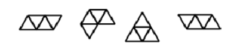

</center>

能做出来首先需要对每个状态进行数学上的表示。在看了别人的博客之后我....终于猜出了大佬们的方法，是一种奇妙的方法，利用坐标系对状态编码。  
当然在写这篇题解时，我也想出了一种比较简单的编码方法

## 编码方式
就是如何对三角形编号，然后根据编号来进行搜索。实际上，我们需要的是，如何通过一串数字来指定一个三角形的状态


<center>


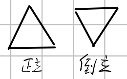

先给出三角形正反的规定

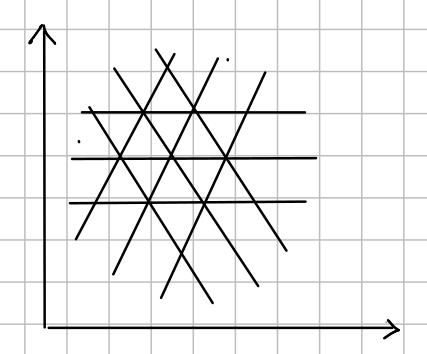

首先要证明一下刚体绕A点旋转可转化为刚体的平移加绕B点旋转，

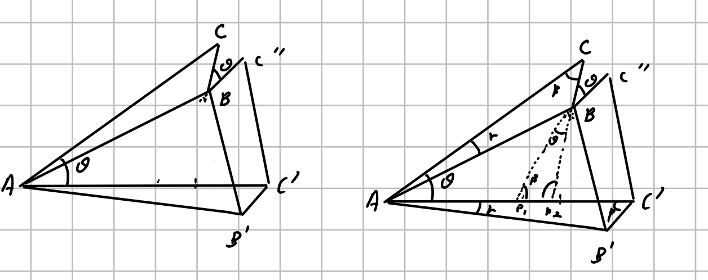

</center>

假设C绕着A线转$\theta$角得到C'，问是否可以通过C绕着其他点，如B点旋转$\theta$之后通过刚体的平移，达到同样效果，其中B'表示的是B绕着A旋转$\theta$之后的结果。


如果两种刚体运动等价，那么必然会有BB' = C''C' 且BB' // C''C'。

这里只给出大概的证明思路，首先AC = AC' BC = BC' 角CAB = 角C'AB',然后证明ABC和AB'C'全等，然后BC = B'C'，这里只要证明BC // B'C'即可。

我们只要能得出在某坐标系下BC''的角度和B'C'角度相等即可，只要得到两个变和某一条边的角度即可，所以这里我们延长BC''到与AC'相平行的直线AC'即可，但是由于仍然无法证明出来角度，这里再将BC也延长，通过三角形相似$CAP_2$和$P_1P_2B$来整明平行。


**于是得到结论，只考虑刚体种坐标的相对位置，刚体绕任意点旋转的结果相同**

如何对图中的三角形进行编号


### 巧妙的编码方式
其使用的方法是将边进行编号，实际上在直角坐标系中的点也可以使用这种方式进行理解
<center>

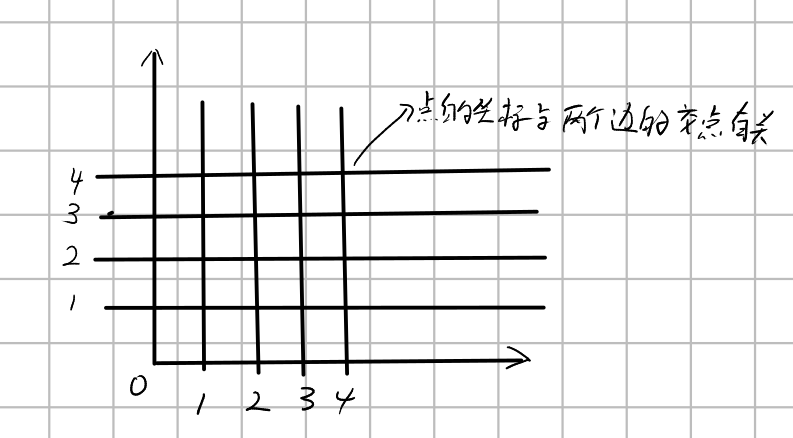
直角坐标系下点坐标的理解

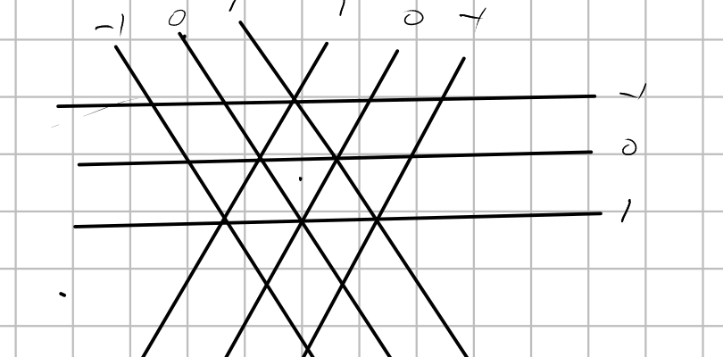

三角形利用边构建坐标

</center>

利用这种方式只要设置合理，再计算三角形形态极为方便，可以看下面的解释。

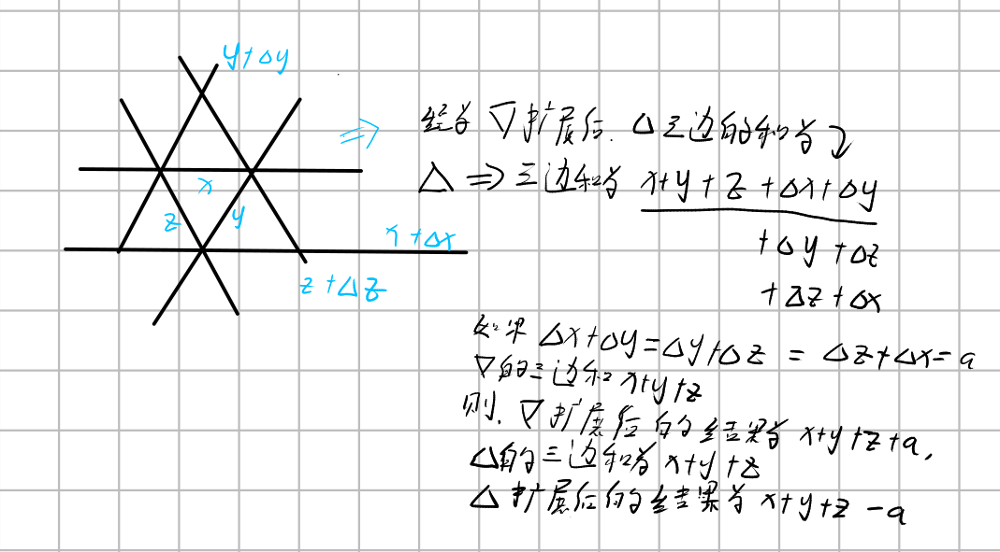

因为两种三角形扩展的时候是交替的，并且边和的变化也是交替+a - a， 所以正立和倒立的三角型和只有两种，如果存在正立的三角形边和为-1（主要是为了让三个为0的边汇聚在一起，使得旋转方便），其周围的倒立三角形和为1
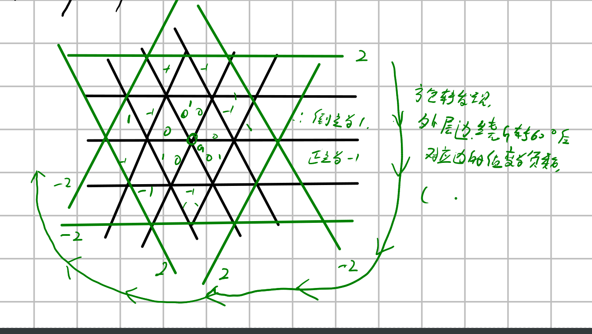
根据边和我们可以判断三角形的状态。同时我们可以观察到当我们按照三个0边的交汇点进行旋转的时候对应的边的值在旋转之后会变为相反数，同时边的方向会改变（相应的，如果用数对表示一个三角形，那么表示三角形的数对中的数会发生交换，同时会将数值变为相反数）。

#### 编码
就是利用边的编号，三条不同编号的边会组成一个三角形。利用这个编号组成三元的数对就能表示一个三角形。


#### 旋转

旋转首先要找到旋转点，我们设旋转点在3个0交汇处，一条边在旋转的过程变换如上所述，其坐标值取相反数，边的方向会发生改变。

例如一个三角形旋转之后，坐标会变为

（x,y,z）==> (-z,-x,-y)


#### 平移

将整个图案看作刚体，然后进行移动，所有三角的坐标变换和二维坐标系中的点平移一样，我们可以考虑单个坐标轴方向上边的平移时坐标的变换。

在单个坐标轴中，移动边和在二维中的情况一致，所以最终平移坐标的时候应该和而为坐标一致。

### 我的编码方式
另一种极易想到的方式就是使用直角坐系来对三角形进行编码，我们可以使用三角形中的一些特殊点来标记三角形。比如说
<center>

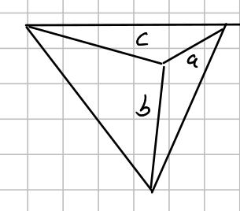

</center>
使用这种不对称的点来代表三角形，但是这种点在旋转的时候会有一定问题
我们发现这种点旋转的时候，正过来的三角和倒过来的三角点不太一致，导致后续我们在平移三角形的时候会出现一些问题，

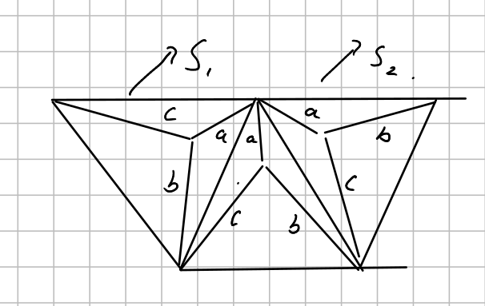
就是当三角形S1移动到S2后，坐标变换方式无法确定

解决的方法也有，就是使用三个点来代表一个三角形
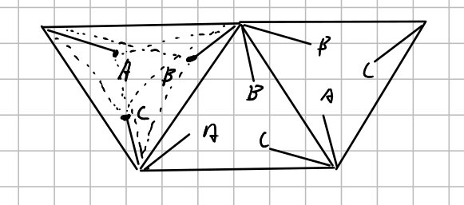
可以看到S1移动到S2不用担心三角形中代表点没有对应的情况了。

但是，这样仍然有个问题，就是使用三个点来表示一个三角形，需要的参数较多，如果三个点重合到一起了，就可以用一个点代替三个点，于是乎！！！有了如下的编码方式！

#### 编码
<center>

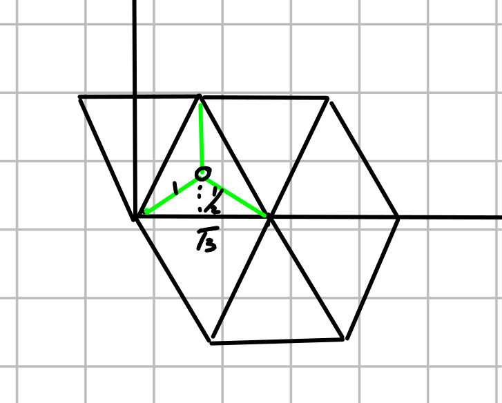
使用三角形的中心点来作为三角形的代表

</center>

如果假设三角形为$\sqrt{3}$的话,那么中心点x坐标会为$\frac{\sqrt{3}}{2}$的倍数，y坐标为$\frac{1}{2}$的倍数，于是我们将坐标压缩$\frac{\sqrt{3}}{2}$，$\frac{1}{2}$倍所得中心点坐标为(a,b),其为整数，利用这个我们进行三角形的表示

这里给出(a,b)与(x,y)的变换公式

$$
\begin{cases}
x = a * \frac{\sqrt{3}}{2}\\
y = b * \frac{1}{2}
\\
\end{cases}
$$

变换之后坐标应变为如下：
<center>

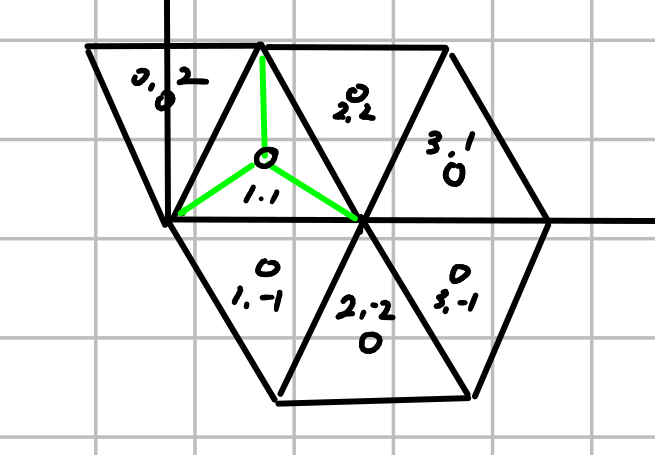

</center>

因为三角形一层一层的罗列，一层高为3，靠近原点上方一层中y == 1的时候三角形为正立，y == 2为倒立，所以可以知道通过y % 3 == 1来判断三角形是正立还是倒立。

#### 旋转60

我们证明过，刚体的旋转绕任何点旋转一定角度之后，刚体内点只之间的位置关系是相同的，所以这里我们在旋转的时候都绕着(0,0)旋转，旋转60度要在xy直角坐标系下推导，不能再我们使用的ab坐标系下推导。


推导如下：

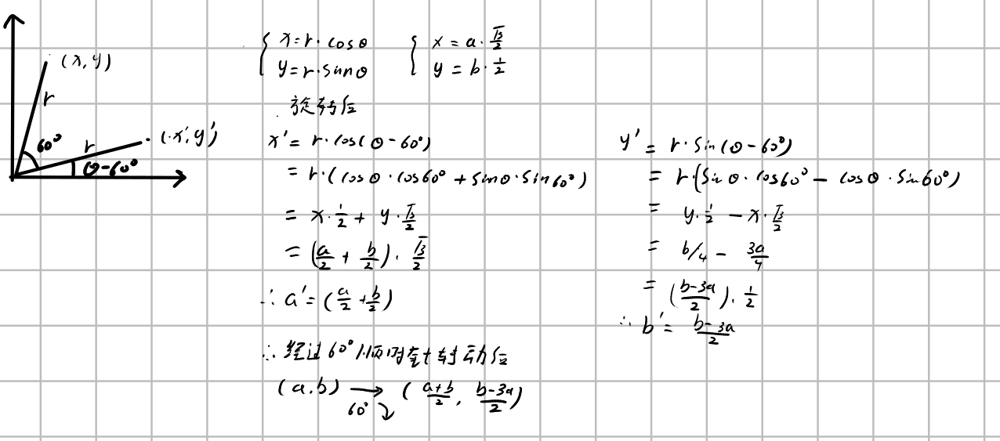

#### 平移

注意一点，正立三角形不能移动到倒立的三角形三角形上，点的移动和直角坐标系的点移动一致，就是加个偏移量，所以将一个三角形移到1，1点的时候首先要判断三角形是不是正立的，否则无法移动。


### 搜索

有了编码方式就是搜索了，我们使用stl中的set判断重复，每搜索到一种情况首先判断其是否在set中，然后将其旋转之后的结果里面每个三角形坐标为(1,1)的其情况加入到set中，然后通过dfs不断枚举多种状态（注意对每一个元素进行扩展哦）。

### 代码

当然具体实现应该看代码

#### 我的编码方式代码
```cpp
#include <algorithm>
#include <cstring>
#include <iostream>
#include <set>
using namespace std;
int maxx_val;
class Pizza {
public:
  void extend(int where) {
    int extend_dir[3][2] = {{-1, 1}, {1, 1}, {0, -2}}; // y *= -1;
    int label = 1;
    if ((((this->y % 3) + 3) % 3) == 1)
      label = 1;
    else
      label = -1;
    this->x += extend_dir[where][0];
    this->y += label * extend_dir[where][1];
  }
  Pizza(int x = 0, int y = 0) {
    this->x = x;
    this->y = y;
  }
  void operator=(const Pizza &temp) {
    this->x = temp.x;
    this->y = temp.y;
  }
  bool operator<(const Pizza &temp) const {
    if (temp.x != this->x)
      return this->x < temp.x;
    return this->y < temp.y;
  }
  bool operator!=(const Pizza &temp) const {
    return !(this->x == temp.x && this->y == temp.y);
  }
  bool operator==(const Pizza &temp) const {
    return temp.x == this->x && temp.y == this->y;
  }
  void rotate() { // clock 60
    int ori_x = this->x, ori_y = this->y;
    this->x = (ori_x + ori_y) / 2;     // -1
    this->y = (ori_y - 3 * ori_x) / 2; // 4 - 2 * 3 / 2
  }
  void move(const Pizza &temp) {
    this->x -= temp.x - 1;
    this->y -= temp.y - 1;
    // 原点设置为1,1
  }
  bool is_positive() {
    int temp_y = this->y;
    temp_y = ((temp_y % 3) + 3) % 3;
    //cout<<"temp_y = "<<temp_y<<endl;
    return temp_y == 1;
  }
  int x, y;
};

class Status {
public:
  Status(Pizza *pizza_f = NULL, int n = 0) {
    for (int i = 0; i < 16; i++) {
      pizza[i].x = 0;
      pizza[i].y = 0;
    }
    if (n > 0) {
      for (int i = 0; i < n; i++) {
        pizza[i].x = pizza_f[i].x;
        pizza[i].y = pizza_f[i].y;
      }
      this->n = n;
    } else
      this->n = n;
  }
  void rotate() {
    for (int i = 0; i < this->n; i++)
      (this->pizza[i]).rotate();
  }
  bool operator<(const Status &temp) const {
    if (this->n != temp.n) {
      return this->n < temp.n;
    }
    for (int i = 0; i < this->n; i++) {
      if (this->pizza[i] != temp.pizza[i])
        return this->pizza[i] < temp.pizza[i];
    }
    return false;
  }
  /*
  bool operator==(const Status &temp) const {
    if (this->n != temp.n)
      return false;
    for (int i = 0; i < this->n; i++) {
      if (this->pizza[i] != temp.pizza[i])
        return false;
    }
    return true;
  }
  */
  void move_to(int which) {
    Pizza temp_pizza = pizza[which];
    for (int i = 0; i < this->n; i++)
      pizza[i].move(temp_pizza);
  }

  bool extend_successful(int posi, int dir) {
    this->n++;
    this->pizza[this->n - 1] = this->pizza[posi];
    this->pizza[this->n - 1].extend(dir);
    for (int i = 0; i < this->n - 1; i++) {
      if (this->pizza[i] == this->pizza[this->n - 1]) {
        delete_num();
        return false;
      }
    }
    return true;
  }
  void delete_num() {
    this->pizza[this->n - 1].x = 0;
    this->pizza[this->n - 1].y = 0;
    this->n--;
  }
  static bool find(Status temp) {
    sort(temp.pizza, temp.pizza + temp.n);
    if (pizza_status.count(temp) == 1) {
      return true;
    }
    // 插入整个群；
    for (int i = 0; i < 6; i++) { // 旋转
      temp.rotate();
      for (int j = 0; j < temp.n; j++) { // 坐标原点
        if (!temp.pizza[j].is_positive())
          continue;
        temp.move_to(j);
        insert_in_set(temp);
      }
    }
    return false;
  }
  static void insert_in_set(Status temp) {
    sort(temp.pizza, temp.pizza + temp.n);
    pizza_status.insert(temp);
  }

  Pizza pizza[16];
  static set<Status> pizza_status;
  int n;
};

set<Status> Status::pizza_status;
int ans[17];
void dfs(int n, Status status) {
  ans[n]++;
  if (n == maxx_val) {
    return;
  }
  for (int i = 0; i < n; i++) {   // 挨个展开
    for (int j = 0; j < 3; j++) { // 三个方向展开
      if (!status.extend_successful(i, j)) {
        continue;
      }
      if (Status::find(status)){
        //cout << status.n << endl;
        status.delete_num();
        continue; // 查到当前状态，不能展开
      }
      dfs(n + 1, status);
      status.delete_num();
    }
  }
}

int main() {
  /*
  Pizza pizza[16];
  pizza[0].x = 1;
  pizza[0].y = 1;
  Status st(pizza, 1);
  scanf("%d", &maxx_val);
  dfs(1, st);
  for (int i = 0; i <= maxx_val; i++) {
    printf("%d ", ans[i]);
  }
  */
  
  int ans_list[] = {0,1,1,1,4,6,19,43,120,307,866,2336,6588,18373,52119,147700,422016};

  int T,Case = 0;
  cin>>T;
  while(T--){
    int i;
    scanf("%d",&i);
    //printf("%d ", ans_list[i]);
    printf("Case #%d: %d\n",++Case,ans_list[i]);
  }

  return 0;
}

```


#### 大佬的编码
```cpp
#include <algorithm>
#include <iostream>
#include <set>
#include <vector>
#define make_table 1
using namespace std;
const int maxx = 18;
class Triangle {
private:
  int x[3]; // 任意一个值只有8种可能（-4，-3， -2，-1，0，1，2，3）

public:
  Triangle(int x = 0, int y = 0, int z = 0) {
    this->x[0] = x;
    this->x[1] = y;
    this->x[2] = z;
  }
  bool operator==(const Triangle &temp) const {
    for (int i = 0; i < 3; i++) {
      if (this->x[i] != temp.x[i])
        return false;
    }
    return true;
  }
  void extend(int edge) {
    int d_val = ((x[0] + x[1] + x[2]) == -1) ? 1 : -1;
    for (int i = 0; i < 3; i++) {
      if (i == edge)
        continue;
      x[i] += d_val;
    }
  };
  /*
  void rotate_180() { // 绕着0，0，0的底边中(0, 0.5, 0.5)点进行旋转
    x[0] = -x[0];
    x[1] = 1 - x[1];
    x[2] = 1 - x[2];
  }
  void rotate_120() {
    int temp = x[0];
    x[0] = x[1];
    x[1] = x[2];
    x[2] = temp;
  }
  */
  void moveto(int *x_) {
    for (int i = 0; i < 3; i++) {
      x[i] -= x_[i];
    }
    x[0] += 1;
  }
  void get_x(int *x_) {
    for (int i = 0; i < 3; i++) {
      x_[i] = x[i];
    }
  }
  int get_sum() { return x[0] + x[1] + x[2]; }
  void rotate() {
    int temp = x[0];
    x[0] = -x[2];
    x[2] = -x[1];
    x[1] = -temp;
  }
  int get_key() {
    int key = 0;
    key += (x[0] - 1 + 8) << 8;
    key += (x[1] + 8) << 4;
    key += (x[2] + 8);
    return key;
  }
};

class Pizza {
private:
  Triangle pizza[maxx];
  int cnt;

public:
  Triangle get_pizza(int posi) { return pizza[posi]; }
  Pizza() { cnt = 0; }
  void add_triangle(Triangle temp_t) {
    pizza[cnt] = temp_t;
    cnt++;
  }
  bool extend(int posi, int edge) { // 扩展cnt指向的最后一个文件的三角形
    add_triangle(pizza[posi]);
    pizza[cnt - 1].extend(edge);
    for (int i = 0; i < cnt - 1; i++) {
      if (pizza[i] == pizza[cnt - 1])
        return false;
    }
    return true;
  }
  void remove() { cnt--; }
  int getcnt() { return cnt; }

  void move_to_ori(int posi) {
    int x_temp[3];
    pizza[posi].get_x(x_temp);
    for (int i = 0; i < cnt; i++) {
      pizza[i].moveto(x_temp);
    }
  }; // TODO : 参数？
  void rotate() {
    for (int i = 0; i < cnt; i++) {
      pizza[i].rotate();
    }
  }; // 旋转60C
  int get_key(int posi) { return pizza[posi].get_key(); };
};
vector<Pizza> ans_pizza[maxx];

class Hash {
private:
  int keys[maxx], cnt;

public:
  bool operator<(const Hash &other) const {
    if (this->cnt != other.cnt)
      return this->cnt < other.cnt;
    for (int i = 0; i < cnt; i++) {
      if (this->keys[i] != other.keys[i])
        return this->keys[i] < other.keys[i];
    }
    // return true;  //TODO: why?
    return false; //
  }
  bool operator==(const Hash &other) const {
    if (this->cnt != other.cnt)
      return false;
    for (int i = 0; i < cnt; i++) {
      if (this->keys[i] != other.keys[i])
        return false;
    }
    return true;
  }
  Hash(Pizza pizza) {
    cnt = pizza.getcnt();
    for (int i = 0; i < cnt; i++) {
      keys[i] = pizza.get_key(i);
    }
    for (int i = cnt; i < maxx; i++)
      keys[i] = 0;
    sort(keys, keys + cnt);
  }
};

set<Hash> vis;

bool search_and_insert(Pizza ori_pizza) {
  // find, move, rotate, find ,move,rotate
  Hash hash_pizza_temp(ori_pizza); // hash_pizza有序集合
  if (vis.find(hash_pizza_temp) != vis.end())
    return true;
  // 加入ori_pizza的同族
  int cnt = ori_pizza.getcnt();
  for (int i = 0; i < 6; i++) {     // rotate enum
    for (int j = 0; j < cnt; j++) { // move enum
      if (ori_pizza.get_pizza(j).get_sum() != 1)
        continue;
      ori_pizza.move_to_ori(j);
      Hash hash_pizza(ori_pizza); // hash_pizza有序集合
      if (vis.find(hash_pizza) == vis.end())
        vis.insert(hash_pizza);
    }
    ori_pizza.rotate(); // 旋转60度
  }
  return false;
}

int ans[maxx];
void dfs(Pizza now_pizza) {
  // 1. extend pizza
  if (now_pizza.getcnt() == 16) {
    ans[now_pizza.getcnt()]++;
    return;
  }
  ans[now_pizza.getcnt()]++;
  ans_pizza[now_pizza.getcnt()].push_back(now_pizza);
  for (int j = 0; j < now_pizza.getcnt(); j++) {
    for (int i = 0; i < 3; i++) { // 三个扩展方向
      if (!now_pizza.extend(j, i)) {
        now_pizza.remove();
        continue;
      }
      if (search_and_insert(now_pizza)) {
        now_pizza.remove();
        continue;
      }
      dfs(now_pizza);
      now_pizza.remove();
    }
  }
}
int output[] = {0,1,1,1,4,6,19,43,120,307,866,2336,6588,18373,52119,147700,422016};
int main() {
  if (make_table) {
    Pizza st_pizza;
    Triangle ori_triangle(1,0,0);
    st_pizza.add_triangle(ori_triangle); //
    dfs(st_pizza);
    for (int i = 1; i < maxx; i++)
      cout << ans[i] << endl;
  } else {
    int n;
    int Case = 0;
    scanf("%d", &n);
    while (n--) {
      int temp;
      scanf("%d", &temp);
      printf("Case #%d: %d\n", ++Case, output[temp]);
    }
  }

  return 0;
}

```
