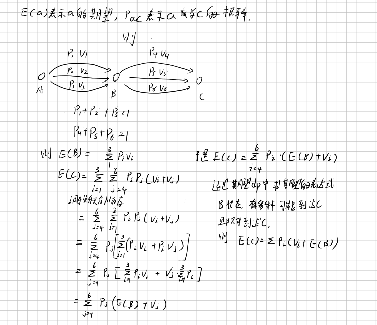

# 期望性质

一个状态A只能到达另一个状态B，但是有多种途径i，其获得值为可加的，这个时候可以使用期望计算公式。
$$
E(B) = \sum_iP_i(v_i + E(A))
$$
$$



## 发红包
这个抢红包系统是这样的：假如现在有 w 元，那么你抢红包能抢到的钱就是 [0,w][0,w] 等概率均匀随机出的一个实数 xx。

现在红包发了一个 w元的红包，有 n 个人来抢。那么请问第 k 个人期望抢到多少钱？

输出答案对 $10^9+7$ 取模后的结果。
输入格式

一行三个整数，w,n,k。
输出格式

第 kk 个人期望抢到的钱数对 $10^9+7$ 取模后的结果。

补充：期望可能是分数，关于分数取模，可以问度娘。

https://www.luogu.com.cn/problem/P5104
```cpp
/*================================================================
*   Copyright (C) 2023 Wangxinpeng. All rights reserved.
*   
*   filename：    p5104.cpp
*   username:     skt1faker
*   create time:  08:48  2023.07.03
    email:        skk1faker@163.com
*   descripe:     
*
================================================================*/

#include<bits/stdc++.h>
using namespace std;
#define ll long long

const ll mod = (ll)1e9 + 7;

ll rev(ll a,ll b){
  ll x = mod - 2;
  ll temp = a;
  ll ans =1 ;
  while(x){
    if(x & 1){
      ans *= temp;
      ans %= mod;
    }
    temp *= temp;
    temp %= mod;
    x /= 2;
  }
  temp = ans;
  ans = 1;
  while(b){
    if(b & 1){
      ans *= temp;
      ans %= mod;
    }
    temp *= temp;
    temp %= mod;
    b /= 2;
  }
  return ans;
}

int main()
{
  ll w,n,k;
  scanf("%lld%lld%lld",&w,&n,&k);
  cout << (w * rev(2,k))% mod<<endl;
  return 0;
}

```


# 收集邮票

## 题目描述

有 $n$ 种不同的邮票，皮皮想收集所有种类的邮票。唯一的收集方法是到同学凡凡那里购买，每次只能买一张，并且买到的邮票究竟是 $n$ 种邮票中的哪一种是等概率的，概率均为 $1/n$。但是由于凡凡也很喜欢邮票，所以皮皮购买第 $k$ 次邮票需要支付 $k$ 元钱。

现在皮皮手中没有邮票，皮皮想知道自己得到所有种类的邮票需要花费的钱数目的期望。

## 输入格式

一行，一个数字 $N$（$N \le 10000$）。

## 输出格式

输出要付出多少钱，保留二位小数。

## 样例 #1

### 样例输入 #1

```
3
```

### 样例输出 #1

```
21.25
```


```cpp
/*================================================================
*   Copyright (C) 2023 Wangxinpeng. All rights reserved.
*   
*   filename：    p4550.cpp
*   username:     skt1faker
*   create time:  09:53  2023.07.31
    email:        skk1faker@163.com
*   descripe:     
*
================================================================*/

#include<bits/stdc++.h>
using namespace std;
#define ll long long

const int maxx = (int)1e4 +10;
double dp[2][maxx];

int main(){
  dp[0][1] = 1;
  dp[1][1] = 1;
  int n;
  cin>>n;
  for(int i = 2;i <=n;i++){
    dp[0][i] = dp[0][i - 1] + (double)(n) / (double)(n - i + 1);
    dp[1][i] = dp[1][i - 1] + (double)(n) / (double)(n - i + 1) * dp[0][i - 1] + ((double)(n) / (n - i + 1.0)) * (n * 1.0) / (n - i + 1.0);
  }
  printf("%0.2lf",dp[1][n]);
}

```

