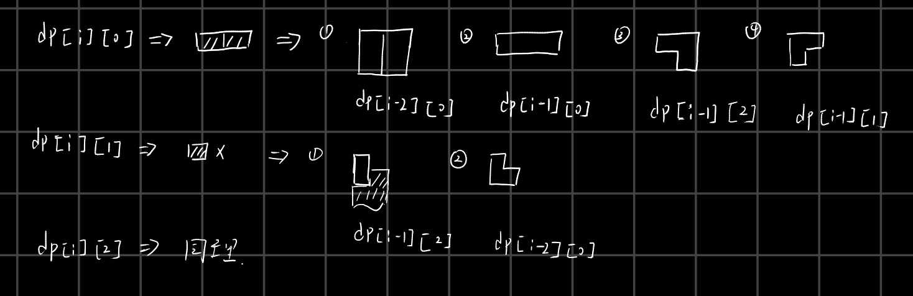

# 覆盖墙壁

## 题目描述

你有一个长为 $N$ 宽为 $2$ 的墙壁，给你两种砖头：一个长 $2$ 宽 $1$，另一个是 L 型覆盖 $3$ 个单元的砖头。如下图：

```
0  0
0  00
```

砖头可以旋转，两种砖头可以无限制提供。你的任务是计算用这两种来覆盖 $N\times 2$ 的墙壁的覆盖方法。例如一个 $2\times3$ 的墙可以有 $5$ 种覆盖方法，如下：
```
012 002 011 001 011  
012 112 022 011 001
```
注意可以使用两种砖头混合起来覆盖，如 $2\times4$ 的墙可以这样覆盖：
```
0112
0012
```
给定 $N$，要求计算 $2\times N$ 的墙壁的覆盖方法。由于结果很大，所以只要求输出最后 $4$ 位。例如 $2\times 13$ 的覆盖方法为 $13465$，只需输出 $3465$ 即可。如果答案少于 $4$ 位，就直接输出就可以，不用加前导 $0$，如 $N=3$ 时输出 $5$。

## 输入格式

一个整数 $N$，表示墙壁的长。

## 输出格式

输出覆盖方法的最后 $4$ 位，如果不足 $4$ 位就输出整个答案。

## 样例 #1

### 样例输入 #1

```
13
```

### 样例输出 #1

```
3465
```

## 提示

数据保证，$1\leq N\leq 1000000$。


状态转移图：

主要考虑当前行有没有砖头，如果有砖的话使用的是什么砖。`dp[i][0]`表示第`i`行满了，`dp[i][1]`表示第`i`行左侧空一格，`dp[i][2]`表示右侧空一格，可以参考他们的二进制位，于是如下转移图。




```cpp
/*================================================================
*   Copyright (C) 2023 Wangxinpeng. All rights reserved.
*   
*   filename：    p1990.cpp
*   username:     skt1faker
*   create time:  14:19  2023.08.07
    email:        skk1faker@163.com
*   descripe:     
*
================================================================*/

#include<bits/stdc++.h>
using namespace std;
#define ll long long
const int maxx = (int)1e7;
int dp[maxx][3];
const int mod = (int)1e4;

int main()
{
  dp[0][0] = 1;
  dp[1][0] = 1;
  int n;
  cin>>n;
  for(int i = 2;i<=n;i++){
    dp[i][0] = (dp[i - 1][0] + dp[i - 2][0] + dp[i - 1][2] + dp[i - 1][1]) % mod;
    dp[i][1] = (dp[i - 2][0] + dp[i - 1][2])% mod;
    dp[i][2] = (dp[i - 2][0] + dp[i - 1][1])% mod;
  }
  cout<<dp[n][0]<<endl;
}
```

