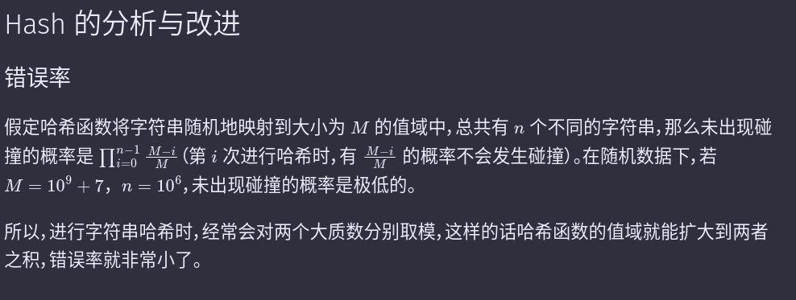

https://oi-wiki.org/string/hash/




字符串hash碰撞概率很小

```cpp
#include<cstdio>
#include<cstring>
#include<iostream>
using namespace std;
#define ull unsigned long long
const int maxn=100000;
const int seed=131;
char a[maxn+10],b[maxn+10];
int hash1[maxn+10],hash2[maxn+10],g[maxn+10],K;
int L1,L2,ans;
int find(int w,int v)
{
    int L=1,R=L2-v+1,res=0;
    while(L<=R){
        int Mid=(L+R)>>1;
        if(hash1[w+Mid-1]-hash1[w-1]*g[Mid]==hash2[v+Mid-1]-hash2[v-1]*g[Mid]) res=Mid,L=Mid+1;
        else R=Mid-1; 
    } return res;
}
bool check(int x)
{
    int w=x,v=1;
    for(int i=1;i<=K;i++){
        int L=find(w,v);
        w=w+L+1; v=v+L+1;
        if(v>L2) return true;
    }
    int L=find(w,v);
    w=w+L; v=v+L;
    if(v>L2) return true;
    return false;
}
int main()
{
    g[0]=1;
    for(int i=1;i<=maxn;i++) g[i]=g[i-1]*seed;
    while(~scanf("%s%s%d",a+1,b+1,&K)){
        L1=strlen(a+1); L2=strlen(b+1); ans=0;
        for(int i=1;i<=L1;i++) hash1[i]=hash1[i-1]*seed+a[i];
        for(int i=1;i<=L2;i++) hash2[i]=hash2[i-1]*seed+b[i];
        for(int i=1;i<=L1-L2+1;i++) 
           if(check(i))  ans++;
        printf("%d\n",ans);
    }
    return 0;
}
-----------------------------------
HihoCoder1084： 扩展KMP（二分+hash，求T串中S串的数量，可以失配一定次数）
https://blog.51cto.com/u_15127677/3546795
```


确定字符串中不同子字符串的数量

问题：给定长为 [n] 的字符串，仅由小写英文字母组成，查找该字符串中不同子串的数量。

为了解决这个问题，我们遍历了所有长度为 $l=1,\cdots ,n$ 的子串。对于每个长度为 $l$ ，我们将其 Hash 值乘以相同的 [b] 的幂次方，并存入一个数组中。数组中不同元素的数量等于字符串中长度不同的子串的数量，并此数字将添加到最终答案中。

为了方便起见，我们将使用 $h [i]$ 作为 Hash 的前缀字符，并定义 $h[0]=0$ 。
```cpp

int count_unique_substrings(string const& s) {
  int n = s.size();

  const int b = 31;
  const int m = 1e9 + 9;
  vector<long long> b_pow(n);
  b_pow[0] = 1;
  for (int i = 1; i < n; i++) b_pow[i] = (b_pow[i - 1] * b) % m;

  vector<long long> h(n + 1, 0);
  for (int i = 0; i < n; i++)
    h[i + 1] = (h[i] + (s[i] - 'a' + 1) * b_pow[i]) % m;

  int cnt = 0;
  for (int l = 1; l <= n; l++) {
    set<long long> hs;
    for (int i = 0; i <= n - l; i++) {
      long long cur_h = (h[i + l] + m - h[i]) % m;
      cur_h = (cur_h * b_pow[n - i - 1]) % m;	// * 10 ^ (n - i - 1) = 10 ^ n / 10 ^ (i + 1);
      hs.insert(cur_h);
    }
    cnt += hs.size();
  }
  return cnt;
}

```

