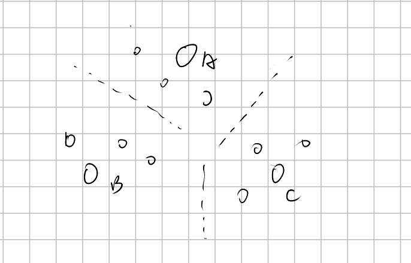
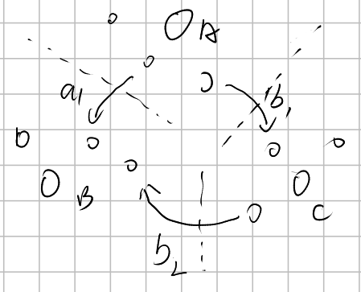

# 道路重建

## 题目描述

从前，在一个王国中，在$n$个城市间有$m$条道路连接，而且任意两个城市之间至多有一条道路直接相连。在经过一次严重的战争之后，有$d$条道路被破坏了。国王想要修复国家的道路系统，现在有两个重要城市$A$和$B$之间的交通中断，国王希望尽快的恢复两个城市之间的连接。你的任务就是修复一些道路使$A$与$B$之间的连接恢复，并要求修复的道路长度最小。

## 输入格式

输入文件第一行为一个整数$n$（$2<n≤100$）,表示城市的个数。这些城市编号从$1$到$n$。  

第二行为一个整数$m$（$n-1≤m≤\frac{1}{2} n(n-1)$），表示道路的数目。  

接下来的$m$行，每行$3$个整数$i,j,k$（$1≤i,j≤n,i≠j,0<k≤100$），表示城市$i$与$j$之间有一条长为$k$的道路相连。  

接下来一行为一个整数$d$（$1≤d≤m$），表示战后被破坏的道路的数目。在接下来的$d$行中，每行两个整数$i$和$j$，表示城市$i$与$j$之间直接相连的道路被破坏。

最后一行为两个整数A和B，代表需要恢复交通的两个重要城市。

## 输出格式

输出文件仅一个整数，表示恢复$A$与$B$间的交通需要修复的道路总长度的最小值。

## 样例 #1

### 样例输入 #1

```
3
2
1 2 1
2 3 2
1
1 2
1 3
```

### 样例输出 #1

```
1
```


注意这道题，有一种思路是错误的

方法一：

```cpp
#include<bits/stdc++.h>
using namespace std;

const int maxx = (int)1e2 + 10;
const int INF = (int)1e6 + 10;
int flod[maxx][maxx]; // 对破坏边使用flod。
int edge_length[maxx][maxx];
int fa[maxx];
void init(){
  for(int i = 0;i < maxx;i++){
    fa[i] = i;
  }
}

int find_fa(int val){
  if(fa[val] == val)return val;
  return fa[val] = find_fa(fa[val]);
}

void merge(int a,int b){
  a = find_fa(a),b = find_fa(b);
  if(a == b)return;
  else fa[b] = a;
}

void solve()
{
  //枚举中间点
  
  int n,m;
  scanf("%d%d",&n,&m);
  for(int i = 1;i <= n;i++){
    for(int j = 1;j <= n;j++){
      edge_length[i][j] = INF;
    }
  }
  for(int i = 0;i < m;i++){
    int a,b;
    scanf("%d%d",&a,&b);
    scanf("%d",&edge_length[a][b]);
    edge_length[b][a] = edge_length[a][b];
  }

  // init 
  for(int i = 1;i <= n;i++){
    for(int j = 1;j <= n;j++)flod[i][j] = INF;
  }
  int num;
  scanf("%d",&num);
  while(num--){
    int a,b;
    scanf("%d%d",&a,&b);
    flod[a][b] = edge_length[a][b];
    flod[b][a] = edge_length[a][b];
    edge_length[a][b] = INF;
    edge_length[b][a] = INF;
  }
  init();
  for(int i = 1;i <= n;i++){
    for(int j = 1;j <= n;j++){
      if(edge_length[i][j] < INF){
        merge(i,j);
      }
    }
  }

  for(int k = 1;k <= n;k++){
    for(int i = 1;i <= n;i++){
      for(int j = 1;j <= n;j++){
        if(flod[i][j] > (flod[i][k] + flod[k][j])){
          flod[i][j] = min(flod[i][k] + flod[k][j],flod[i][j]); 
          if(flod[i][j] == 439)
          cout<<flod[i][j]<<endl;
        }
      }
    }
  }
  int posi1,posi2;
  scanf("%d%d",&posi1,&posi2);
  posi1 = find_fa(posi1);
  posi2 = find_fa(posi2);
  if(posi1 == posi2){
    cout<<0;
    return;
  }
  int ans = INF;
  for(int i = 1;i <= n;i++){
    for(int j = 1;j <= n;j++){
      if((find_fa(i) == posi1 && find_fa(j) == posi2 ))//||(find_fa(i) == posi2 && find_fa(j) == posi1) )
        {
        cout<<i<<' '<<j<<endl;
        ans = min(ans, flod[i][j]);
        cout<<flod[i][j]<<endl;
      }
    }
  }
    if(ans == INF){
        cout<<-1;
return;
    }
  cout<<ans;
}


int main()
{
  solve();
  return 0;
}


```

这份代码会错误原因是他的思路有点小问题。



思路是这样的，首先我将我未破坏的边连接点使用并查集分为组，假如要计算AB值之间需要修理的费用，则对破坏边跑一遍flody，然后计算A所在集合的点和B所在集合的点之间点的最段距离即可。


但是实际上这个是不可能的，因为A到B可能还会经历中间集合，即这个最短路径是b1b2而不是a1，所以。。。这个问题还需要将集合视为一个点，各个集合之间的最段距离视为边长，再次计算最短路。




方法二：

将修理边的费用视为边的距离，那么连接边不需要修理，边长位0，破坏边需要修理，然后未连接边也算破坏边的一种，他永远修理不上，所以设位无穷。

