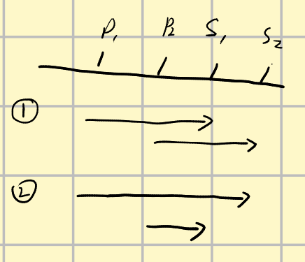
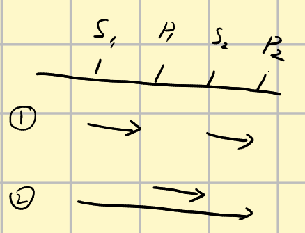

## 题意

输入n  然后输入n个施工队的位置（一维坐标） 然后输入m 再输入m个防御点的位置（一维坐标），1<=m<=n<=4000   一维坐标小于1e9  现在让所有的施工队进入防御点，且每个防御点必须有施工队进入，求所有施工队走的最小距离和，并输出每个施工队去的防御点编号；

## 题解

这题需要证明一个猜想，最优解就是空间上排序连续的几个人会进入同一个位置，其他不与其连续的不会再进入这个位置了，假设现在已经形成这个局面，人为pi，工事为si，那么。

p1  位于s1

p2  位于s2

s1 < s2，p1 < p2

当前分配情况交换之后会怎样

当前值为|p1 - s1| + |p2 - s2|,交换后为|p1 - s2| + |p2 - s1|

分类讨论：

 1. s1 < s2 < p1 < p2或者p1 < p2 < s1 < s2

    此时|p1 - s1| + |p2 - s2| = |p1 - s2| + |p2 - s1|， 任意安排都可以

    

 2. s1 < p1 < s2 < p2 或者p1 < s1 < p2 < s2

    $|s1 - p1| + |s2 - p2| < |s1 - p2 | + |s2 - p1|$

于是必然有排序后连续的数分到连续的点，

所以我们首先要对人和堡垒的位置进行排序。

然后设$dp[i][j]$​表示为前j个人放在前i个堡垒的排布最小距离,注意由于每个堡垒都要有人，所以最后一个人一定在j堡垒，否则，根据上面的优化方案，这里不会有人来。所以状态转移方程为

$dp[i][j] = min(dp[i - 1][j - 1],dp[i][j - 1]) + abs(p[j] - s[i])$，表示j可能是第一个来i的人，或者不是。

