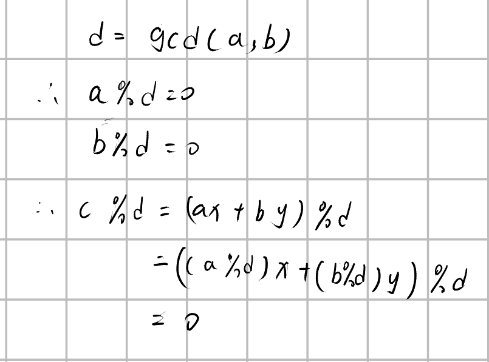
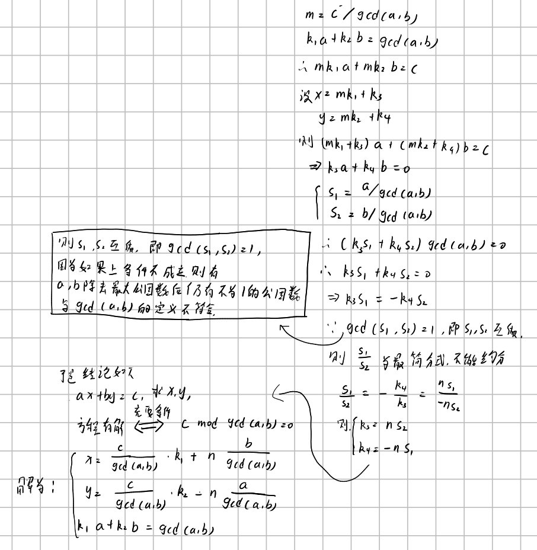
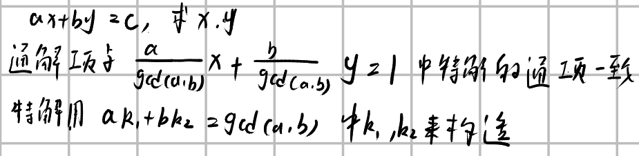

已知整数`a,b,c`，求解整数`x,y`使之满足`ax + by = c`

首先可以知道的是，如果有解的话，则必然会有$c\ mod\ gcd(a,b) = 0$

证明如下：

当前仅能说明上述是有解的必要条件。但其实$c\ mod\ gcd(a,b) = 0$​这也是方程有解的充分条件，因为辗转相除法的特性（就是gcd(a,b)必有解对应），我们可以得到 
$$
\begin{cases}
ak_1 + bk_2 &= gcd(a,b) \\
m &= \frac{c}{gcd(a,b)} \\ 
amk_1 + bmk_2 &= c
\end{cases}
$$

充分条件给出了不定方程的**特解**的求解方法，接下来介绍如何求解通解。

简单的可以记为

