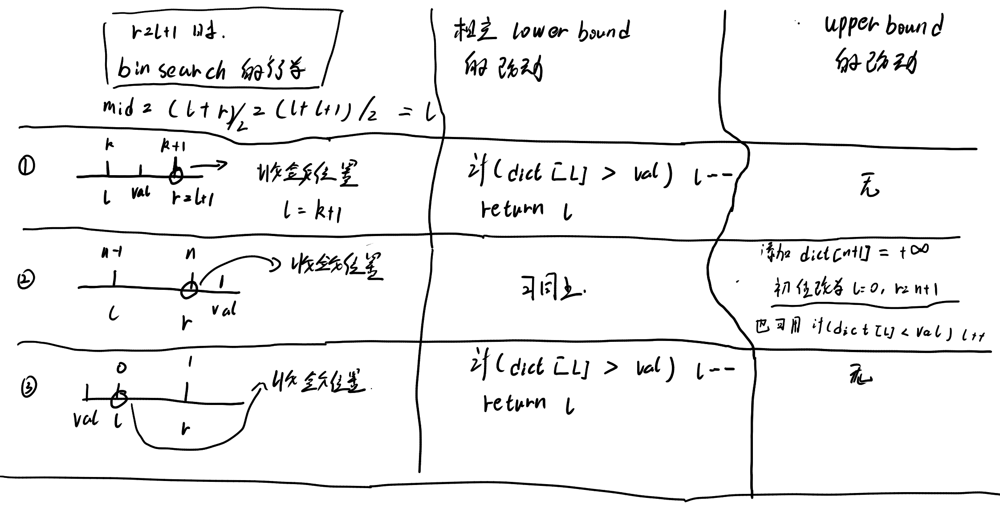

```cpp


const int maxx = (int)1e5;
int dict[maxx];

int bin_search(int n,int val)
{   // 注意这个可以查到的区间为0 -- n
    int l = 0, r = n;
    while(l < r){
        int mid = (l + r)<<1;
        if(dict[mid] < val){
            l = mid + 1;
        }
        else if(dict[mid] == val){
            r = mid;	// 写为 l == mid 则会不断循环，
            //若为l == mid + 1虽然可以结束循环，但是会丢解。
        }
        else {
            r = mid;
        }
        // 注意检验当 r == l + 1的时候， 是否能结束。
        // 当查找的元素在dict中一定会命中
        /* 如果不在这里的话，看需要比val小的元素还是比val元素大的元素, 
            需要考虑两种情况：
            1. l + 1 == r的时候下一步怎么更新
            2. val < dict[0] 和val > dict[n]的情况。
            下面给出取上界和下界的函数
        */
    }
    return l;
}

int lower_bound(int n,int val){
    int l = 0,r = n;
    while(l < r){
        int mid = (l + r) << 1;
        if(dict[mid] < val){
            l = mid + 1;
        }
        else if(dict[mid] == val){
            r = mid;
        }
        else if(dict[mid] > val){
            r = mid;
        }
    }
    if(val < dict[l])l--;
    return l;
}
// upper_bound 第一种写法
int uper_bound(int n, int val){
    int l = 0,r = n + 1;
    dict[n + 1] = (int)1e9;	// 注意这里
    while(l < r){
        int mid = (l + r) >> 1;
        if(dict[mid] < val){
            l = mid + 1;
        }
        else if(dict[mid] == val){
            r = mid;
        }
        else if(dict[mid] > val){
            r = mid;
        }
    }
    return l;
}

// upper_bound 第二种写法

int uper_bound(int n, int val){
    int l = 0,r = n ;
    while(l < r){
        int mid = (l + r) >> 1;
        if(dict[mid] < val){
            l = mid + 1;
        }
        else if(dict[mid] == val){
            r = mid;
        }
        else if(dict[mid] > val){
            r = mid;
        }
    }
    if(dict[l] < val) l++;	// 注意这里
    return l;
}


```




#### uva10635

```cpp
/*================================================================
*   Copyright (C) 2023 Sangfor Ltd. All rights reserved.
*   
*   filename：    uva10635.cpp
*   username:     skt1faker
*   create time:  21:14  2023.05.13
    email:        skk1faker@163.com
*   descripe:     
*
================================================================*/

#include<bits/stdc++.h>
using namespace std;

const int maxx = 250 * 250 + 1;
int dp[maxx];

int B[maxx];
int translate[maxx];


int bin_find(int val ,int ri){
  int l = 0,r = ri;
  while(l < r){
    int mid = (l + r) >> 1;
    if(dp[mid] < val){
      l = mid + 1;
    }
    else if(dp[mid] == val){  // 两个元素的时候应该如何选择
       r = mid;
      //l = mid;  会导致死循环， 如果是l = mid + 1则可能丢解。
    }
    else {
      r = mid;
    }
  }
  // 决定是upperbound和downbounder整实际上和if(dp[mid] == val)没有关系，是在两个相邻节点的时候val在两节点中间，这个时候算法如何取值是算法为upperbound 还是downbounder的区别。
  dp[l] = min(dp[l], val);
  return l;
}

int main()
{
  int T;
  cin>>T;
  int Case = 0;
  while(T--){
    memset(dp,0x3f3f3f3f,sizeof(dp));
    memset(translate,0x3f3f3f3f,sizeof(translate));
    int n,p,q;
    cin>>n>>p>>q;
    for(int i = 0;i <= p;i++){
      int temp;
      scanf("%d", &temp);
      translate[temp] = i;
    }
    for(int i = 0;i <= q;i++){
      int temp;
      scanf("%d",&temp);
      B[i] = translate[temp];
    }
    int ans = 0;
    dp[0] = -1;  // 第一个位置元素为0， 此时长素为0;
    for(int i = 0; i <= q;i++){
      ans = max(ans, bin_find(B[i], q + 1));
    }
    printf("Case %d: %d\n",++Case,ans);
  }
  return 0;
}

```


## uva1450

### 题意
机场有两个仓库，两个仓库每次只能选择一个仓库将飞机起飞， 每一时刻会有飞机加入两个仓库，假设任意时刻两个仓库飞机数量最大值为a，问给出一种起飞方案，使得任意时刻a <= x， 求这个x值最小为多大。

二分法，但是需要检验枚举的答案是否满足题意。

因为起飞方案并不好确定，但是我们可以知道任意时刻总共可以起飞的数量和两个仓库可以起飞的数量（两个仓库的可以起飞数量必须要计算，）然后我们分别计算0时刻到当前时刻最少需要的起飞数量即可，如果只比较总的起飞数量那么是不对的， 因为a库起飞50但是a中只有10个飞机起飞的名额就会出问题。

```cpp
/*================================================================
*   Copyright (C) 2023 Sangfor Ltd. All rights reserved.
*
*   filename：    uva1450.cpp
*   username:     skt1faker
*   create time:  11:13  2023.05.20
    email:        skk1faker@163.com
*   descripe:
*
================================================================*/
#include <iostream>
#include <cstdio>
#include <cstring>
#include <algorithm>

using namespace std;

const int MAXN = 5005;

int t;
int A[MAXN], B[MAXN];

int judge(int n) {
    int cura = 0, curb = 0, num = 0; 
    int a, b;
    int ta = 0,tb = 0;
    for (int i = 0; i < t; i++) {
        cura += A[i]; 
        curb += B[i]; 
        a = max(cura - n, 0);
        b = max(curb - n, 0);
        if (a + b > num)
            return false; 
        if(a > ta)
            return false;
        if(b > tb)
            return false;
        if (cura + curb > num) 
            num++;   
        if (cura > ta)
            ta++;
        if(curb > tb)
            tb++;
    }
    return true;
}

int main() {
    int cas; 
    scanf("%d", &cas);
    while (cas--) {
        scanf("%d", &t);         
        for (int i = 0; i < t; i++) 
            scanf("%d%d", &A[i], &B[i]);

        int L = 1, R = MAXN * 20, mid;
        while (L < R) {
            mid = (R + L) / 2; 
            if (judge(mid)) 
                R = mid;
            else
                L = mid + 1; 
        }
        printf("%d\n", L - 1); 
    }
    return 0;
}

```

