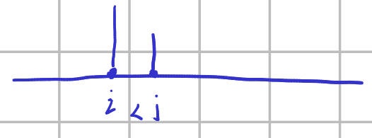

单调栈可以用于区间求解最值，离线rmq问题也可以，方法是对查询区间按照右端点排序，然后右端点相得则按照左端点相等来处理, 由于是在一个区间里面判断元素最值，所以值以，栈中元素记得记录元素在数组中的位置。 

## 另一类问题

1. 给出两个字符串序列，求一个最长区间，区间内不相等的字符串数量不大于p%

实际上这个问题可以进行转化，使用不等式来描述这个问题$(sum[j] - sum[i]) / (j - i) <= \frac{p}{100}， j < i$​，然后进行变型之后发现，$100sum[j] - pj <= 100sum[i] - pi$​，发现只要两个位置的值之间满足这样一个关系就能保证题目描述的不等式成立。现在的问题就是求满足不等式的最大$|j - i|$是什么。
### 方法一
一种方法是记录每个点的位置，然后按照上述不等式排序，将位置作为优化的对象，从前向后扫描排序后的数组，记录当前位置前面最小的位置值，和当前位置的位置值对比计算答案。

### 方法二

另一种方法就是使用一个数组记录所有可能作为答案的位置，首先假设所有位置都可能为答案，

 

假设i,j两个位置都可能作为答案区间的左端点，如j成为答案是不可能的，因为区间右端点的值要小于区间左端点的值，j满足条件则i也满足条件，因为i位置更远，导致区间长度更长，所以j无法作为候选的答案，所以候选答案应该在数组最开始的位置$100sum[0] - 0p = 0$开始递增。得到答案的方法就是从头扫描整个数组，维护一个可能的答案数组，扫描到i位置就判断i位置是否可能作为未来的答案，如果是则加入到数组中，然后使用二分法查找满足i位置作为区间右端点时满足条件的区间左端点是哪个，如果没有区间的话就会查到其刚刚加入数组的值，也就是其本身，区间长度为0.

代码：

```cpp
/*================================================================
*   Copyright (C) 2023 Sangfor Ltd. All rights reserved.
*
*   filename：    uva1392.cpp
*   username:     skt1faker
*   create time:  22:00  2023.05.24
    email:        skk1faker@163.com
*   descripe:
*
================================================================*/

#include <bits/stdc++.h>
using namespace std;
const int maxx = (int)2e5 + 10;
char str[2][maxx];
struct Point {
  int sum, id;
  bool operator<(Point p) { return this->sum < p.sum; }
} po[2], q[maxx];

int main() {
  int n, p;
  int top = 0;
  int ans = 0;
  while (scanf("%d%d", &n, &p) == 2 && n != 0 && p != 0) {
    top = 0;
    ans = 0;
    scanf("%s%s", str[0], str[1]);
    po[0].sum = 0;
    for (int i = 1; i <= n; i++) {
      po[i % 2].sum = po[(i - 1) % 2].sum + 100 * (str[0][i - 1] != str[1][i - 1]) - p;
      po[i % 2].id = i;
      if (q[top].sum < po[i % 2].sum)
        q[++top] = po[i % 2];
      int l = 0, r = top;
      while (l < r) {
        int mid = (l + r) >> 1;
        if (q[mid].sum < po[i % 2].sum) {
          l = mid + 1;
        } else {
          r = mid;
        }
      }
      ans = max(ans, po[i % 2].id - q[l].id );
    }
    if(ans == 0){
      cout<<"No solution."<<endl;
    }
    else cout << ans << endl;
  }
}


```


