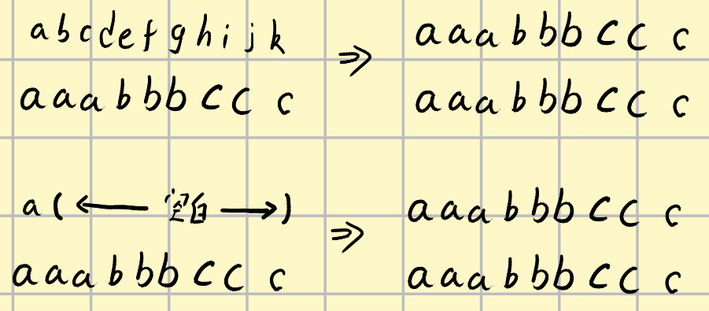
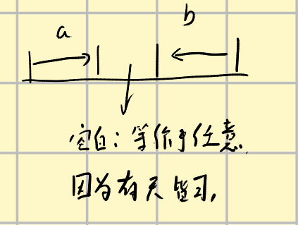
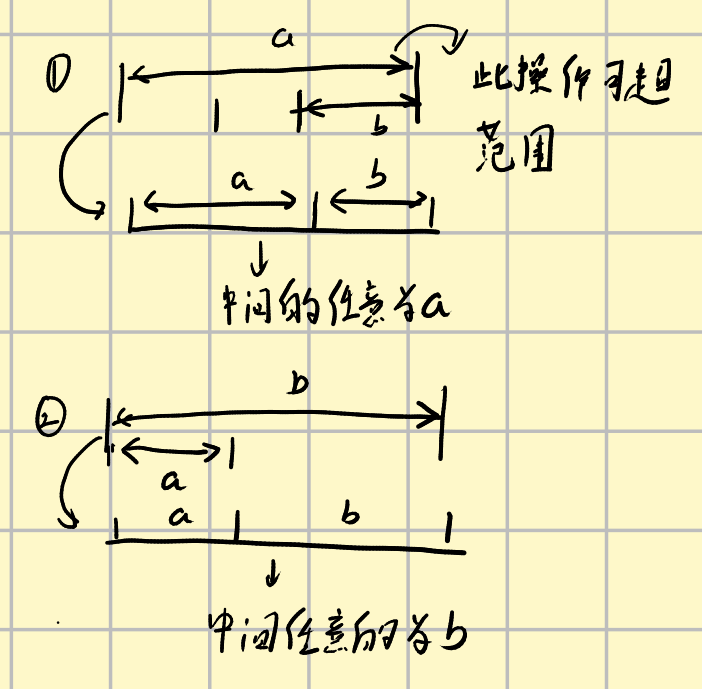

## UVA1437 String painter

## 题面翻译

题目：字符串刷子

描述：

有两个用小写英文字母组成的等长字符串。你有一个强大的字符串刷子，在这把刷子的帮助下，你可以将一个字符串的一个字串中的字符全部刷成任何你想要的字符。也就是说，用刷子刷过的字串就变成用同一个字母组成的了。现在你想要用这一把刷子把字符串A刷成B，而且要求刷的次数最少。

输入格式：

输入包含多组数据，每组数据由两行组成：

第一行一个字符串A，第二行一个字符串B.

在同一组数据中，保证A和B长度相等。

输出格式：

对于每组数据，单独的一行输出刷的最小次数。

感谢@Mickey_snow 提供翻译

## 题目描述

[problemUrl]: https://uva.onlinejudge.org/index.php?option=com_onlinejudge&Itemid=8&category=447&page=show_problem&problem=4183

[PDF](https://uva.onlinejudge.org/external/14/p1437.pdf)

## 输入格式

## 输出格式

## 样例 #1

### 样例输入 #1

```
hfcnndeziymohaewnrbmquyhigwm
bcbysbjvxbzvmspshggrzaukbipm
jmmeqimjobpxyavjneyvyuuhhwiqowmme
kmpgpviubhzrjkezqqoilsuwgedctxkxl
ikynfrlcsltkrbdkdqpirtdnajhzhbhipeqtyxvskhkti
qmziwxbbjzjfymrzvflthsbaqgdoqmiduiudviqzztclb
vwysgqniecydcycqk
cqgudqbkgcsvimpdj
mcrrqwfegpnukyuk
vezrniuriscgtcth
rdjtgk
wzfycu
nwxqfdtigwj
rrhcndwcohx
knjmrwlwxfroyppgxhrknntrvbcqjrranufutrginldqydsjsfyjqfyqq
lghrdjsgvbffgfpclqmrzzoniyhlsoisgpbfdqpiblsbtirrbdjdjxsuy
nujagihmgqvwiwvbmbe
pnxicvskosnzneztzhd
bzjvffvyv
mnvjbgwdw
```

### 样例输出 #1

```
20
26
33
15
13
6
8
43
15
8
```

## 题解

要分成两个dp来做
由于对一段进行粉刷之后会造成原有字符串内容全部失效，后续粉刷的结果和从空白粉刷是一样的（因为二者颜色不同）




所以我们要先计算从空白到 目标串的粉刷最小次数。

## 空串到S

如果S[i] != S[j]，那么$dp[i][j]$​​​可以是从两个个空串（两个空串间操作毫不相干）的操作得来的

我们先说为什么可以$dp[i][j]$​中的一些操作可以分为两个毫不相干的操作。

左右端点可以被先粉刷，因为端点不可能被多次粉刷，不从端点开始的操作无法影响端点，从端点开始的操作发生一次就可以，它可以先被安排。考虑左端点或者右端点第一次进行了粉刷，粉刷最远端如果在后续操作中被改变了说明粉刷本来不需要刷那么远，所以必然有一个粉刷有意义的最远位置在后续操作中不会被改变，这个位置就是两个毫不相干操作的分界点。

那么，S[i] == S[j]应该怎样解决呢，我们先说明当S[i] != S[j] 时，初始两部操作可以不分顺序，可以无限远。

假设$S[i -- j]$表示从i到j的字符串，字符串两端不等，$dp[i][j]$在最开始两步的时候粉刷情况为



我们可以证明，为了达到这种情况我们可以使用如下方法进行粉刷



因为中间任意。

两种操作次数均为2。

如果我们遇到S[i] == S[j]的情况时，我们可以在刷S[i]的同时运用上述方法把S[j]刷了，问题就转化为了求S[i , (j - 1)]或者S[(i + 1) , j]的粉刷方案。这样问题就又能逐渐转化为s[i] != s[j]的情况了。


## A到S

### 方法一

那么从宏观上看一定是A中的一部分串被看成空串了，空串和空串之间相隔一定距离。设D[i]表示A[0 -- i]变为S[0 -- i]的操作于是这个dp操作可以这样写

$D[i]= dp[0][i]$

if(S[i] != A[i])$D[i] = min(D[j] + dp[j + 1][i], D[i])$

else D[i] = min(D[i], D[i - 1])

### 方法二：

我们知道S[i] ！= A[i]，S[j] != A[j]的时候这时候从i开始的某一位置和从j开始的某一位置会被视为空串来进行处理，两个位置我们枚举一个，另一个交给递归来处理就可以得到答案。

S[i] != A[i],S[j]!=A[j]的时候我们可以不刷，不刷时一定可以减小答案的，所以我们直接对这种地方条过。

代码如下：

```cpp
#include<bits/stdc++.h>

using namespace std;

const int maxx = 205;
int dp[maxx][maxx][2];
char a[maxx],b[maxx];

int main()
{
  int n;
  while(scanf("%s%s",a,b) == 2){
    memset(dp,0x3f3f3f3f,sizeof(dp));
    n = strlen(a);
    for(int length = 1;length <= n;length++){
      for(int i = 0, j = length - 1 + i;i < n && j < n;i++,j++){
        if(length == 1)dp[i][j][0] = 1;
        else {
          if(b[i] != b[j]){
            for(int k = i;k < j;k++){
              dp[i][j][0] = min(dp[i][j][0], dp[i][k][0] + dp[k + 1][j][0]);
            }
          }
          else {
            dp[i][j][0] = min(dp[i][j - 1][0], dp[i + 1][j][0]);
          }
        }
      }
    }
    for(int length = 1;length <= n;length++){
      for(int i = 0,j = length - 1 + i;i < n && j < n;i++,j++){
        dp[i][j][1] = dp[i][j][0];
        if(length == 1){
          if(a[i] == b[i]) dp[i][j][1] = 0;
        }
        else {
          if(a[i] == b[i])dp[i][j][1] = min(dp[i][j][1], dp[i + 1][j][1]);
          else if(a[j] == b[j])dp[i][j][1] = min(dp[i][j][1],dp[i][j - 1][1]);
          else {
            for(int k = i;k < j ;k++){
              dp[i][j][1] = min(dp[i][j][1] ,dp[i][k][0] + dp[k + 1][j][1]);
              dp[i][j][1] = min(dp[i][j][1], dp[i][k][1] + dp[k + 1][j][0]);
            }
          }

        }
      }
    }
    cout<<dp[0][n - 1][1]<<endl;
  }
  return 0;
}

```

