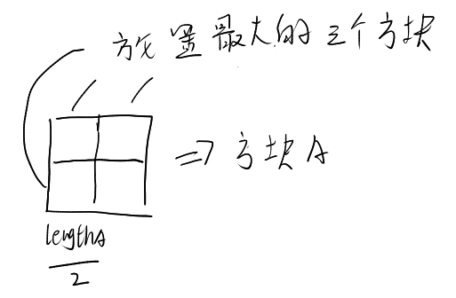
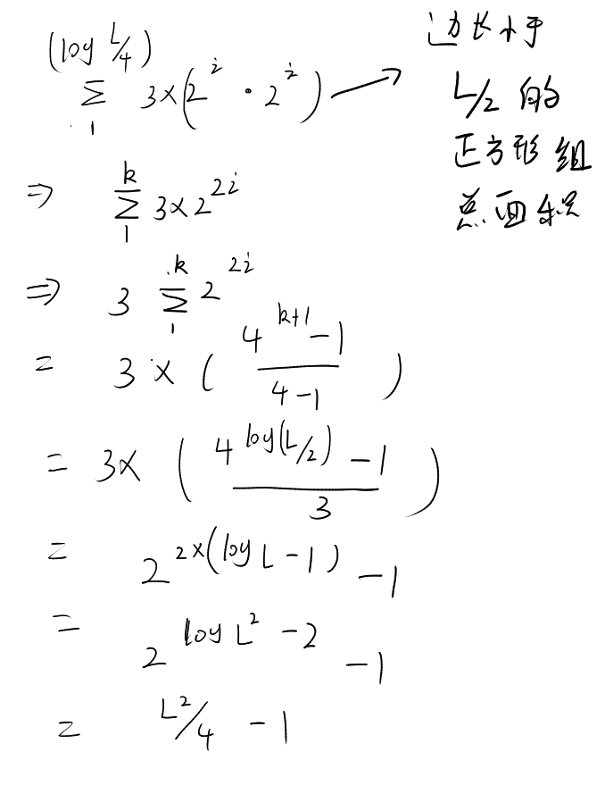

## 问题描述

​	已知有多个边长不同且大小为2的幂次的方块，现要用这种方块填充一个大正方形，问是否可以填充成功。例如 512 * 512，512 * 512，128 * 128， 64 * 64 填充一个1024 * 1024的方块。

## 解答

这个问题实际上可以只要小方块面积的和比大方块小就可以完成填充。或者说，对于一组给定的正方形，边长为2的幂次，我们有对应的算法生成一个排列方案，使得其可以放在一个大正方形内。

我们重新描述上述问题

对与长度小于$L$的正方形，如果所有正方形面积和不超过大正方形的面积$L^2$，那么是否存在一种摆放使得小正方形可以平铺其中。

想要证明上述结论，我们可以这样，给出如下排列方式，对于四个同样边长的正方形方块，我们可以合成一个边长扩大一倍的方块 ，对所有方块做这样的操作，那么一定最终会有每个边长相同的方块少于4个，我们要放入的大正方形记为A，边长为 $L$，假设所有小方块的面积小于A的面积，那么合并后的结果长度最大的块一定小于L，且最多为三个，

对方块这样安置之后，剩余的方块和A中剩下的方块成了新的问题

因为剩下的小方块长度一定小于$length_A / 2$，并且同种变长的块最多有三个，根据几何级数的结论

最终的结果小于$L^2 / 4$,所以问题可以向下递归

对与长度小于L/2的正方形，如果所有正方形面积和不超过大正方形的面积$L^2/4$​，那么是否存在一种摆放使得小正方形可以平铺其中。

这时处理方法和上面一样,将4个同样大小的正方形合成一个更大的正方形，直到所有正方形不可以合并,然后将最大长度的正方形取处,放在大正方形的三个小格子上,继续递归,直到

对与长度小于2的正方形，如果所有正方形面积和不超过大正方形的面积$4$​，那么是否存在一种摆放使得小正方形可以平铺其中。那么显然，面积为4的正方形摆放为1，1，1，0即可摆放的下

