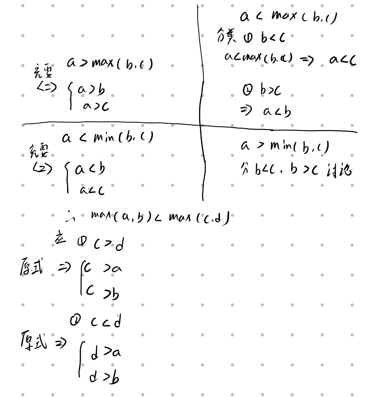
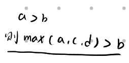
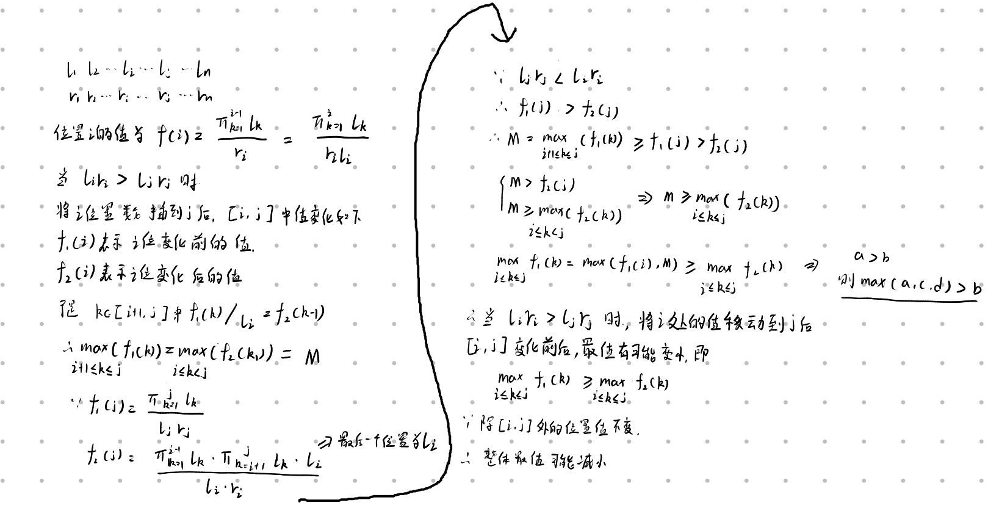

# p1080国王的游戏

## 交换元素的方法会给出最优解吗？？

给一个组数对$(x_i,y_i)$共n个，求$max_{k = 1}^{k = n}(\frac{\prod^{k - 1}_{1}x_i}{y_k})$最小值。

$luogu$中给出好多证明两个满足$x_i*y_i < x_j * y_j$，这个时候$i,j$处元素按照一定顺序排列即可，有人说要交换两个元素，然后就能证明按照$x_i * y_i$排序就能得到最值，使用交换ij处元素进行证明的我不知道怎么能证明排序之后会得到最优解，原因有两个：

1. 交换元素后i,j中间的元素计算值会发生变化，变化为原来的$x_j / x_i$倍，但是这个数是否大于1，在条件$x_i * y_i > x_j * y_j$的关系式中无法体现，所以两个元素中间的元素变化未知，所以，消去一个$x_i * y_i > x_j * y_j$条件后可能会出现更多的这样的条件，那么程序会停止嘛。

2. 如果程序会停止，那么为什么按照这种交换的方式会得到最优解，（有上面可知，每次交换起始也未必会将最大值降低，因为存在一些位置的值会升高），是否会因为这个算法找到局部最优解，而不是全局最优解。（在局部最优解，算法可能会终止，但是并不是最终的最优解）

   

对于其中的一些证明过程，不等式处理的实在是太难看了，这里给出max，min不等式如何处理。

以及下面要用到的

## 我认为的真正解法

以上交换的解法无法进行解释，我给出我的解法。

现已经知道，当$l_ir_i > l_jr_j$时将i位置的数移动到j位置之后即可使序列整体最值减小或保持不变，

假设已知最优解存在，如果$l_ir_i$最值不在后面，那么我们可以将其放在最后面，这个操作只会降低或者不影响整体最值变化，因为已经找到最优解，所以不会降低整体最值。

然后我们将$l_ir_i$次大放在第二个位置，同样不会破坏最优解最小值，以此类推，最终序列会按照$l_ir_i$排好顺序，此时依旧是最优解，因为排序结果只有一个，而最优解的情况之一就是排序结果，所以排完序就可以得到最终答案。

