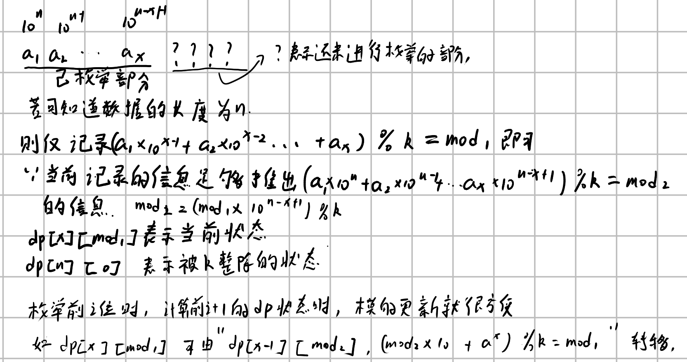
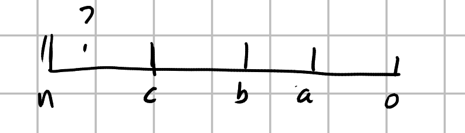
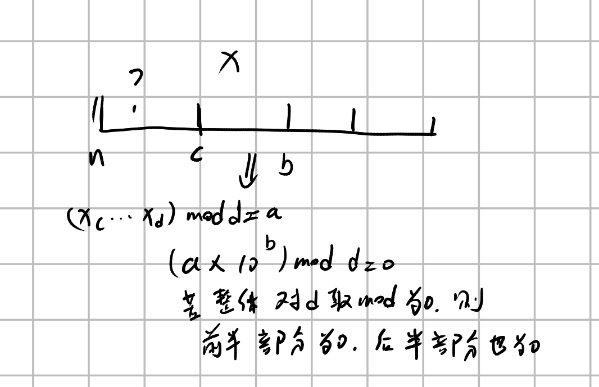

# 数位dp

## 一些问题

1. 如何处理取模（一般整除问题会用到）。

   一般来讲都是从最高位向最低位进行枚举，然后dp中可以加入已经枚举的参数的取模大小，而不是其在枚举之后的数中真实的取模大小，（实际上二者是等价的，但是前面的更加好维护），如下图所示：

   $dp[i][j]$​表示的是枚举到第i位，前i位的模为j时，**后面数字有多少种排列方案**。

   

   比较好的例题可以看cf628d,cf507d

2. 注意，计算的时候，例如枚举第一位的时候要注意0的特殊处理，一个数字有时候不能有前导0（例如规定位数位n，出现前导0位数就会发生变化）


## cf507d

大意，给一个n和d，计算长度为n且没有前导0的数字的个数，其满足从某一位置到最后一位置的非零数字可以被d整除



如果我们通过计算从$[i-0]$位置的数字可被d整除然后乘以前面$[n,i-1]$位置的字符串个数的话这样计数会有重复问题。假设有三个位置a,b,c，$[a,0],[b,0],[c,0]$之间的的数非零且都可被d整除，那么一个数在满足上面条件的时候会被计算三次，所以不能按照这样的方法分类，对于一个这样的数，只有选择三个位置值中的一个位置记录才能保证不重复，一般取最后面一个或者最前面一个就可以了，这里我们选择取最后面一个，也就是我们枚举的对像，我们假设$dp[i][j]$表示的是“从长度为i，且前面数字取模后值为j，$[i - 1,0]$中无子串可以被d整除这样数字的组成个数”，其中一个条件“$[i - 1,0]$中无子串可以被d整除”我们可以转换一下，因为我们要计算整体可被d整除，如果后面部分可被d整除，那么可以转换为前面部分乘以相应位数也可以被d整除。



转换完之后就方便写代码了，代码如下

```cpp
#include <bits/stdc++.h>

using namespace std;

int n, k, mod;
const int maxn = 1005;
const int maxk = 105;
long long dp[maxn][maxk];
long long  pow_10[maxn];

void init(){
  pow_10[0] = 1;
  for(int i = 1;i <= n;i++){
    pow_10[i] = (pow_10[i - 1] * 10 ) % k;
  }
}

long long dp_dfs(int length,
                 int pre_mod_val) { // 前面模为pre_mod_val，子串不包含取模为0的部分，整体取模为0，后面的部分有多少种取法。
  if (dp[length][pre_mod_val] != -1)
    return dp[length][pre_mod_val];
  if (length == 0) {                // 当前长度为0
    if (pre_mod_val == 0)
      return 1;
    else
      return 0;
  }
  if (((pre_mod_val * pow_10[length]) % k) == 0)    // 当前段模为0，假设整体取模为0，如果后面部分取值不为0，那么后面部分取模为0就不符合定义了，只有后面都是0才符合定义。
    return 1; 
  long long ans = 0;
  for (int i = 0; i <= 9; i++) {
    ans += dp_dfs(length - 1, (pre_mod_val * 10 + i) % k);
    ans %= mod;
  }
  return dp[length][pre_mod_val] = ans;
}

int main() {
  scanf("%d%d%d", &n, &k, &mod);
  init();
  memset(dp, -1, sizeof(dp));
  long long ans = 0;
  long long prefix = 1;
  for (int posi = n; posi >= 1; posi--) {
    int min_val = (posi == n);
    for (int i = 1; i <= 9; i++) {  // 枚举串开始的第一个位置
      //cout << prefix * dp_dfs(posi - 1, i % k)<<endl;;
      ans += prefix * dp_dfs(posi - 1, i % k);
      ans %= mod;
    }
    if(posi == n)prefix *= 9;
    else prefix *= 10;
    prefix %= mod;
  }
  cout << ans << endl;
}

```


## cf913c

因为最多有1000个1， 转化完之后接下来转化的次数很容易确定，所以这个题可以转化为计算数字中1的个数。

然后这个题接下来就很简单了，只需要计算$dp[i][j]$​,i表示剩余长度为i且个数为1的数字，**满足上述条件的数有多少（可以出现前导0）**

由于1的特殊性（只有1位1，但是变换次数位0，2、4、8也有1位1但是变换需要1次）代码会视为1是需要一次变换的，但实际上需要0次，所以在计算t = 1和t = 0的时候，我们要处理好1，在t  == 1时，答案 - 1，t = 0的时候直接返回1 % m (防止 m == 1 需要返回0);

还有一点，计算dp的时候要注意优化时间复杂度
$$
dp[i][j] = \sum_{k\in[j,i]}dp[k - 1][j-1]	\\k枚举第一个1在那个位置
$$
这个表达式的时间复杂度为O(n^3)，n = 1000一定会超时，

于是经过优化，我想到了一种方法
$$
dp[i][j] = dp[i - 1][j] + dp[i - 1][j - 1] \\
这个表示第i个位置为1和不为1的情况
$$


下面给出源码：

```cpp
#include<bits/stdc++.h>
using namespace std;

map<int ,set<int>> bits;  // 操作次数， 1有多少位
int op[1001];
const int mod = 1e9 + 7;
const int maxl = 1e3 + 5;
long long dp[maxl][maxl]; // 长度， 1数量 >> 含前导0的数字个数

void init(){
  op[1] = 1;
  bits[1].insert(1);
  //  op[0] = ?; 0 这种是根本不可能变化过来的
  for(int i = 2;i <= 1000;i++){
    int j  = i;
    int ans = 0;
    while(j){
      ans += (j)&1;
      j = j >> 1;
    }
    op[i] = op[ans] + 1;
    bits[op[i]].insert(i);
  }
  memset(dp,0,sizeof(dp));
  dp[0][0] = 1;
  for(int i = 1;i <= 1000;i++){
    for(int j = 0;j <= i;j++){
      if(j == 0){
        dp[i][j] = 1;
        continue;
      }
      /*
      for(int k = j;k <= i;k++){
        dp[i][j] += dp[k - 1][j - 1];
        dp[i][j] %= mod;
       // cout << dp[i][j] << endl;
      }
      */
      dp[i][j] += dp[i - 1][j];
      dp[i][j] %= mod;
      dp[i][j] += dp[i - 1][j - 1];
      dp[i][j] %= mod;

    }
  }
  
}


int k;

long long get_ans(char *data){
  if(k == 0)return 1 % mod;
  long long ans = -1 * (k == 1);    // 因为k == 1的时候
  int now_one_num = 0;
  int length = strlen(data);
  for(int i = 0;i < length;i++){
    if(data[i] == '1'){
      for(int num_1 : bits[k]){
        //if(length - 1 - i <= num_1 - now_one_num){
        if(num_1 - now_one_num >= 0){
          ans += dp[length - 1 - i][num_1 - now_one_num] ;//为0时
          ans %= mod;
        }
      }
      now_one_num ++;
    }
  }
  return (ans + (op[now_one_num] == k)) %mod;   // 注意我们没有判断数字data需要经过几次变换才能成为1，所以要补上
    
  
}

int main()
{
  init();
  char data[maxl];
  scanf("%s",data);
  scanf("%d",&k);
  cout<<get_ans(data)<<endl;
  return 0;
}

```

