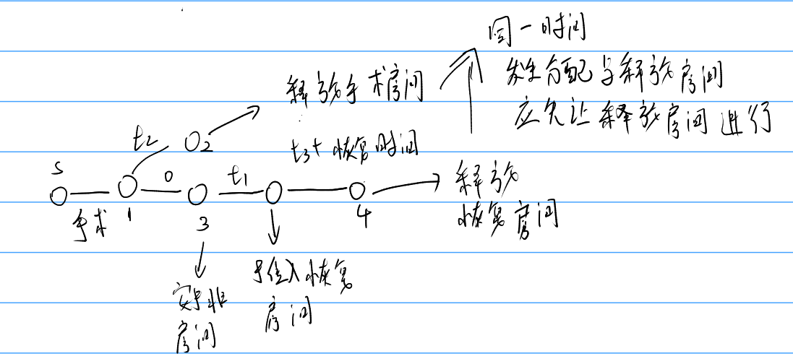

# 模拟题

## 模拟时间
在这里我们可以将各个事件看成一个节点，一个事件到达另一个事件需要一些时间，时间看作边，使用dijstra算法就可以将这些事件按照正常时间顺序或者时间在时间上发生的顺序给模拟起来。



以下是uva212的题解。


```cpp
/*================================================================
*   Copyright (C) 2023 Sangfor Ltd. All rights reserved.
*
*   filename：    uva212.cpp
*   username:     skt1faker
*   create time:  04:23  2023.05.13
    email:        skk1faker@163.com
*   descripe:
*
================================================================*/

#include <bits/stdc++.h>
using namespace std;

int priority_id[4] = {3,1,4,2};

struct event {
  int time_point;
  int event_val;
  int room_id;
  int id;
  // 1. operator finish
  // 2. operator in
  // 3. restore in
  // 4. restore finish
  event(int time_point, int event_val, int room_id, int id)
      : time_point(time_point), event_val(event_val), room_id(room_id), id(id) {
  }
  bool operator<(const event &a) const {
    if (this->time_point != a.time_point)
      return this->time_point > a.time_point;
    if(this->event_val != a.event_val)
      return priority_id[this->event_val - 1] > priority_id[a.event_val - 1];
    return this->room_id > a.room_id ;
  }
};

const int maxT = 12 * 60;
priority_queue<event> event_finish_table;   // 模拟时间可以用dijstra的思想, 每一个事件或者说阶段作为一个节点，然后时间就是边长。
priority_queue<int, vector<int>, greater<int>> operator_room, restore_room;

const int maxx = 100 + 10;
string name[maxx];
int restore_time[maxx];

double usage_persent(double a, int b) {
  if (b == 0) {
    return 0;
  }
  return a / b;
}
struct room_arrange {
  int room_id;
  int start_time;
  int end_time;
  room_arrange(int room_id = 0, int start_time = 0, int end_time = 0)
      : room_id(room_id), start_time(start_time), end_time(end_time) {}
} arrange_list[maxx * 2];

int oproom[11], reroom[31], start_time = -1, end_time = 0;

int main() {
  int n, m, T, t1, t2, t3, k;
  while (scanf("%d%d%d%d%d%d%d", &n, &m, &T, &t1, &t2, &t3, &k) != -1) {
    int id = 0;
    end_time = 0;
    start_time = -1;
    while(!event_finish_table.empty()){
      event_finish_table.pop();
    }
    while(!operator_room.empty()){
      operator_room.pop();
    }
    while(!restore_room.empty()){
      restore_room.pop();
    }
    for (int i = 1; i <= n; i++){
      oproom[i] = 0;
      operator_room.push(i);
    }
    for (int i = 1; i <= m; i++){
      reroom[i] = 0;
      restore_room.push(i);
    }
    int operator_time;
    int now_time = T * 60;
    int notfinish = k;
    while (notfinish) {
      while (operator_room.size() >= 1 && id < k) {
        if (start_time == -1)
          start_time = now_time;
        cin >> name[id];
        scanf("%d%d", &operator_time, &restore_time[id]); // 有空闲的时候。
        int room_id = operator_room.top();
        operator_room.pop();
        event_finish_table.push(
            event(now_time + operator_time, 1, room_id, id));
        // record
        arrange_list[id * 2] =
            room_arrange(room_id, now_time, now_time + operator_time);
        oproom[room_id] += operator_time;
        ++id;
      }
      event t = event_finish_table.top();
      event_finish_table.pop();
      switch (t.event_val) {
      case 1: {
        t.event_val = 3;
        event_finish_table.push(t);
        t.time_point += t2;
        t.event_val = 2;
        event_finish_table.push(t);
      } break;
      case 2: {
        now_time = t.time_point;
        operator_room.push(t.room_id);
      } break;
      case 3: {
        t.time_point += t1;
        t.room_id = restore_room.top();
        restore_room.pop();
        arrange_list[t.id * 2 + 1] = room_arrange(
            t.room_id, t.time_point, t.time_point + restore_time[t.id]);
        end_time = max(end_time, t.time_point + restore_time[t.id]);
        reroom[t.room_id] += restore_time[t.id];
        t.time_point += restore_time[t.id] + t3;
        t.event_val = 4;
        event_finish_table.push(t);
      } break;
      case 4: {
        restore_room.push(t.room_id);
        notfinish--;
      } break;
      }
    }
    printf(" Patient          Operating Room          Recovery Room\n");
    printf(" #  Name     Room#  Begin   End      Bed#  Begin    End\n");
    printf(" ------------------------------------------------------\n");
    for (int i = 0; i < k; i++) {
      printf("%2d  %-8s  %2d   %2d:%02d   %2d:%02d     %2d   %2d:%02d   "
             "%2d:%02d\n",
             i + 1, name[i].c_str(), arrange_list[i * 2].room_id,
             arrange_list[i * 2].start_time / 60,
             arrange_list[i * 2].start_time % 60,
             arrange_list[i * 2].end_time / 60,
             arrange_list[i * 2].end_time % 60, arrange_list[i * 2 + 1].room_id,
             arrange_list[i * 2 + 1].start_time / 60,
             arrange_list[i * 2 + 1].start_time % 60,
             arrange_list[i * 2 + 1].end_time / 60,
             arrange_list[i * 2 + 1].end_time % 60);
    }
    cout << endl;
    printf("Facility Utilization\n");
    printf("Type  # Minutes  %% Used\n");
    printf("-------------------------\n");
    for (int i = 1; i <= n; i++) {
      printf("Room %2d%8d%8.2lf\n", i, oproom[i],
             usage_persent((100.0 * oproom[i]), (end_time - start_time)));
    }
    for (int i = 1; i <= m; i++) {
      printf("Bed  %2d%8d%8.2lf\n", i, reroom[i],
             usage_persent((100.0 * reroom[i]), (end_time - start_time)));
    }
    cout<<endl;
  }
  return 0;
}

```

