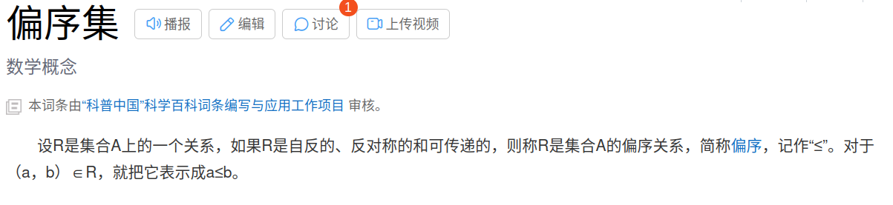

## 极角排序 

https://codeforces.com/contest/598/problem/C

```cpp
/================================================================
*   Copyright (C) 2023 Wangxinpeng. All rights reserved.
*   
*   filename：    cf598c.cpp
*   username:     skt1faker
*   create time:  20:16  2023.06.26
    email:        skk1faker@163.com
*   descripe:     
*
================================================================*/

#include<bits/stdc++.h>
using namespace std;
#define ll long long
long double tpi = 2 * acos(-1);
long double pi =  1 * acos(-1);

const int maxx = (int)1e5 + 10;
int get_posi(int x,int y){
  if(x > 0 && y >= 0)return  0;
  if(x <= 0 && y > 0)return  1;
  if(x < 0 && y <= 0)return  2;
  if(x >= 0 && y < 0)return  3;
  return -1;
}
struct point{
  ll x,y;
  int id;
  long double theta;
  bool operator < (const point &p){
    if(get_posi(x,y) ==  get_posi(p.x,p.y)){
      int ret = compare(*this,p);
      if(ret == 0){
        return get_posi(x,y) < get_posi(p.x,p.y);
      }
      return ret > 0;
    }
    else {
      return get_posi(x,y) < get_posi(p.x,p.y);
    }
  }
  static int compare(point a, point b){
    return a.x * b.y - a.y * b.x;
  }
  double len(){
    return sqrt(x * x + y * y);
  }
  long double get_theta()
  {
    if (x == 0){
      if(y > 0)
        return pi / 2;
      else 
        return 3 * pi / 2;
    }
    int posi = get_posi(x,y);
    if(posi == 0){
      return atan((long double)y / (long double)x);
    }
    else if(posi == 1){

      return pi + atan((long double)y / (long double)x);
    }
    else if(posi == 2){

      return pi + atan((long double)y / (long double)x);
    }
    else {
      return atan((long double)y / (long double)x);
    }
  }
}p[maxx];

int main(){
  int n;
  cin>>n;
  for(int i = 0;i< n;i++){
    scanf("%lld%lld",&p[i].x,&p[i].y);
    p[i].id = i;
  }
  sort(p,p+n);
  int p1, p2;
  long double ans = 10;
  for(int i = 0;i < n;i++){
    //cout<<p[i % n].id + 1 <<' '<<p[i % n].x<<' '<<p[i % n].y<<endl;
    //long double temp = (p[(i - 1 + n) % n].x * p[i % n].x + p[(i - 1 + n) % n].y * p[i % n].y)  / (p[i % n].len() * p[(i - 1 + n) % n].len());

    long double temp = p[(i) % n].get_theta() - p[(i - 1 + n) % n].get_theta();
    while(temp < 0){
      temp+= tpi;
    }
    while(temp > pi){
      temp = tpi - temp;
    }
    //cout<<"temp = "<<temp<<endl;
    if(ans > temp){
      ans = temp;
      p1 = p[(i - 1 + n) % n].id;
      p2 = p[i % n].id;
      //cout<<p1 + 1<<' '<<p2 + 1<<endl;
      //cout<<p[i % n].x <<' '<<p[i % n].y <<' '<<p[(i - 1 + n) % n].x <<' '<<p[(i - 1 + n) % n].y<<endl;
    }
  }

  cout<<p1 + 1<<' '<<p2 + 1<<endl;
  return 0;
}

```

极角排序，排序可以使用叉积进行比较两个角的大小关系，

但是由于极角使用叉积判断的时候，因为叉积无法领极角构成偏序集，利用这个关系是没有办法排序的

不是偏序集的原因是因为假如存在4个点$p_1,p_2,p_3,p_4$​，我们定义 <= 为p1,p2叉积大于0，那么如果p1 <= p2 <= p3 <= p4，那么如果为偏序集必有p1 <= p4， 但是实际上p4 --> p1实际上之间的顺时针夹角可能小于180，即p4与p1的叉积也有可能为正，也就是p4 <= p1， 这就违反了偏序集的概念，所以他不能排序。

之所以不能排序是因为我们没有办法确定一个最大值，根据上面的说法，原因在于，我们的比较范围大于了180，导致开头和结尾之间的角度关系错乱，所以：

我们可以按照4个象限将点分开，不同象限之间排序，然后就能确定角的最大和最小。
