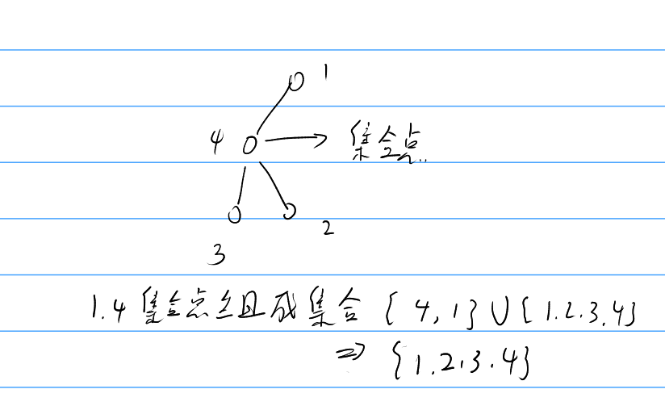
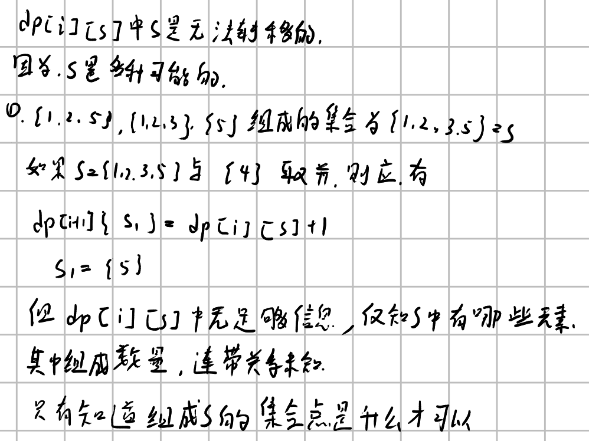

# 状压dp

(题目连接)[https://www.luogu.com.cn/problem/UVA11825]

## 题目描述

假如你是一个黑客，侵入了一个有着 $n$ 台计算机（编号为$0,1,2,3....n-1$）的网络。一共有 $n$ 种服务，每台计算机都运行着所有服务。对于每台计算机，你都可以选择一项服务，终止这台计算机和所有与它相邻计算机的该项服务（如果其中一些服务已经停止，那他们继续保持停止状态）。你的目标是让尽量多的服务完全瘫痪(即：没有任何计算及运行着该服务)

## 简短题面：

你需要将 n 个集合分成尽量多组，使得每一组里面所有集合的并集等于全集。

## 输入格式

输入包含多组数据，每组数据的第一行为整数 $n(1\leq n\leq 16)$ : 以下 $n$ 行每行描述一台计算机相邻的计算机，其中第一个数 $m$ 为相邻计算机个数，接下来的 $m$ 个整数为这些计算机的编号。输入结束标志 $n=0$。

## 输出格式

对于每组数据，输出完全瘫痪的服务的数量。

## 解答

我们用集合点表示文中的计算机，这里包括了很多计算机， 而集合表示的是集合点表示的计算机的集合

 

1. 最开始的思路， 我设计了这样的dp状态， $dp[i][S]$中， i表示选择前i个集合点，前i个集合点任意组队，不能构成全集的集合点的并集结果为S，$dp[i][S]$就表示了当前状态下表示的最大全集数量。但是这个状态转移有一些问题， 就是S再与其他集合点表示的集合求与之后，如果结果为并集，那么不知道该怎么转移。

   

   

2.  于是，因为上面提到需要知道集合是由哪些集合点组成的，所以尝试使用集合点作为状态，考虑到集合点最多有16个，于是使用状压dp。

   $dp[S]$​​中S的每一位表示集合点是否存在，转移方式就是
   $for(S_0\in S) dp[S] = dp[S - S_0] + val[S_0]$​，$val[S]$表示的是S是否能组成一个全集，是则为1，否则为0.

   初看这个转移方程为$2^n * 2^n = 2 ^ {2n} = 4 ^ n = 4^{16} = 2 ^{32} = 4 \times 1024 ^ 3 $，一看这个时间就超了，但是仔细计算的话，实际上这个时间应该为：
   $$
   \sum^{n}_{k = 0}C_{n}^{k}*2^{k} = 3^{n} = 3 ^ {16} = 4\times 10^7
   $$
   
   
   时间还够用。

