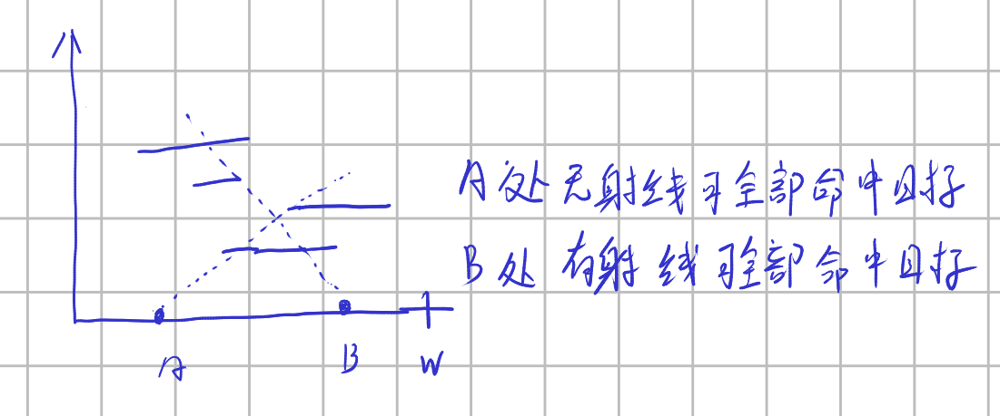
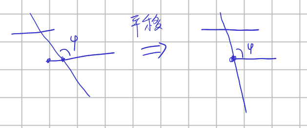
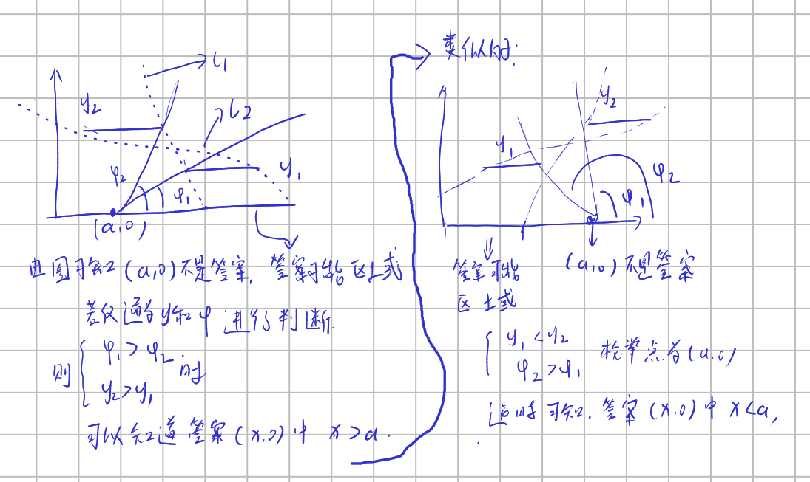
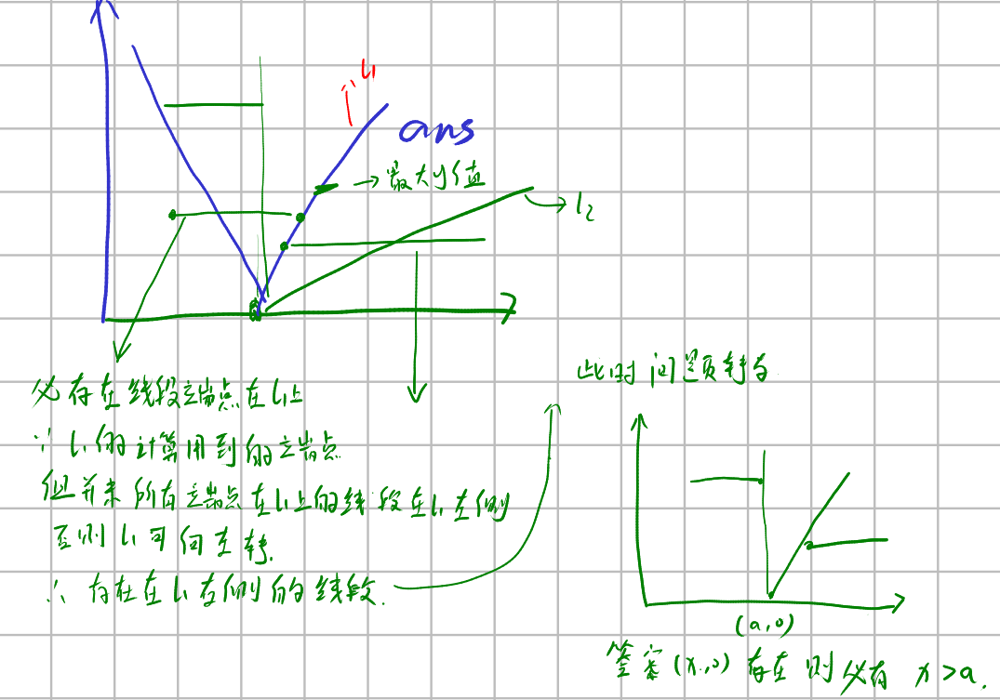

# 什么样子的题可以使用二分

假设当前值为答案，通过一个判断函数可以知道接下来真正的答案应该比假设的答案大还是比假设的答案小。

## uva1421



给定n个平行于x轴的线段，每个线段y值不一样，问是否存在一个$x\in(0,W)， X\in R^+$满足（x,0）发出的射线可以穿过多个线段。

### 方法一，枚举

将问题换个说法，给n个线段和(0,0)和(W,0)组成的线段共n + 1个线段，问是否存在一个直线可以穿越n+1个线段。

首先证明：如果存在解，则必然存在经过n + 1个边中的某个边的一个边界点



方法很简单，就是将已知解平移一下，直到不可平移，说明再平移会少穿越一些线段，这种情况只能发生在当前已经平移到某个线段端点的情况。

知道这个之后，我们枚举所有边界点为答案，然后判断其是否为答案， 通过逐步计算直线再当前点于其他线段相交的旋转范围的交集是否为空来判断当前点是否为解。

```cpp
const int maxx = (int)5e3 + 10;
const double eps = 1e-6;
const double pi = 4 * atan(1);
struct length {
  double x[2], y;
} tar[maxx];
int T, W, n;

double fi(double x, double y, double x1, double y1) {
  if (fabs(x - x1) < eps) {
    return pi / 2 ;
  }
  double ans = atan((y1 - y) / (x1 - x));
  if (ans < 0)
    ans += pi;
  return ans;
}

void calcul(double x, double y, int posi, double *ans) {
  for (int i = 0; i < 2; i++)
    ans[i] = fi(x, y, tar[posi].x[i], tar[posi].y);
  if (ans[0] > ans[1]) {
    swap(ans[0], ans[1]);
  }
}

bool check(double x, double y, int posi_now) {
  double ans_[2];
  calcul(x, y, n, ans_);
  for (int i = 0; i < n; i++) {
    if (i == posi_now)
      continue;
    double fi_[2];
    calcul(x, y, i, fi_);
    ans_[0] = max(ans_[0], fi_[0]);
    ans_[1] = min(ans_[1], fi_[1]);
    if (ans_[0] > ans_[1] + eps)
      return false;
    //if(fabs(ans_[0] - ans_[1]) < eps)return false;
  }
  return true;
}

int main() {
  scanf("%d", &T);
  while (T--) {
    scanf("%d%d", &W, &n);
    for (int i = 0; i < n; i++) {
      scanf("%lf%lf%lf", &tar[i].y, &tar[i].x[0], &tar[i].x[1]);
    }
    tar[n].y = 0;
    tar[n].x[0] = 0;
    tar[n].x[1] = W;
    int flag = 0;
    for (int i = 0; i < n && flag == 0; i++) {
      for (int j = 0; j < 2; j++) {
        if (check(tar[i].x[j], tar[i].y, i)) {
          flag = 1;
          break;
        }
      }
    }
    if (flag) {
      cout << "YES" << endl;
    } else {
      cout << "NO" << endl;
    }
  }
}

```


### 方法二,二分

这需要用二分的思想，我们首先假设只有两个线段。



当线段只有两个的时候，我们发现，通过y值和$\phi$值可以判断答案再枚举答案的左边还是右边，有了这个想法那么再多条线段的情况下，就有可能通过二分来解决。

枚举当前答案位置（x,0)然后按照y从小到大的计算顺序计算当前射线可偏转的范围$\phi$​可以判断答案的可能位置。方法见下。



代码：

```cpp
/*================================================================
*   Copyright (C) 2023 Sangfor Ltd. All rights reserved.
*
*   filename：    uva1421.cpp
*   username:     skt1faker
*   create time:  10:35  2023.05.27
    email:        skk1faker@163.com
*   descripe:
*
================================================================*/
#include <bits/stdc++.h>
using namespace std;
int n,T;
double W;
const int maxx = (int)5e3 + 10;
const double eps = 1e-6;
const double pi = 4 * atan(1);
struct Target
{
  double x[2],y;
  bool operator <  (const Target &t) const {
    return y < t.y;
  }
}tar[maxx];

double fi(double x,double y,double x1,double y1){
  if(fabs(x - x1) < eps){
    return pi / 2;
  }
  double ans = atan((y - y1) / (x - x1));
  if(ans < 0)ans += pi;
  return ans;
}
void cal_range(double mid, int posi, double ans[])
{
  ans[0] = fi(mid,0, tar[posi].x[0],tar[posi].y);
  ans[1] = fi(mid,0, tar[posi].x[1],tar[posi].y);
  if(ans[0] > ans[1])swap(ans[0], ans[1]);
  
}

int check()
{

  double l = 0,r = W;
  while(fabs(l - r) > eps){
    double mid = (l + r) / 2;
    double  ans[2] = {0,pi};
    int flag = 0;
    //cout<<endl;
    for(int i = 0;i < n;i++){
      double temp_ans[2];
      cal_range(mid,i,temp_ans);
      //cout<<ans[0] <<' '<<ans[1]<<' '<<mid<<endl;
      if(temp_ans[1] < ans[0] - eps){
        flag = 1;
        r = mid;
        break;
      }
      if(temp_ans[0] > ans[1] + eps){
        flag = 1;
        l = mid;
        break;
      }
      ans[0] = max(ans[0], temp_ans[0]);
      ans[1] = min(ans[1], temp_ans[1]);
    }
    if(flag == 0)return 1;
  }
  return 0;
}

int main()
{
  cin>>T;
  while(T--){
    scanf("%lf%d",&W,&n);
    int min_posi = 0;
    for(int i =0;i < n;i++){
      scanf("%lf%lf%lf",&tar[i].y,&tar[i].x[0], &tar[i].x[1]);
    }
    sort(tar,tar+n);

    if(check())cout<<"YES"<<endl;
    else cout<<"NO"<<endl;
  }
}

```

